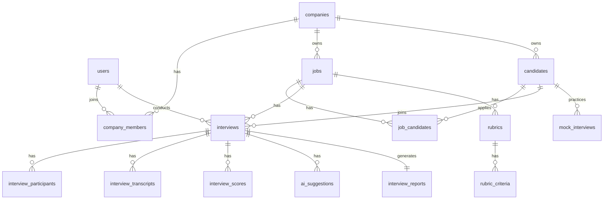

# DATABASE_DESIGN.md
# Thiết kế cơ sở dữ liệu — AI Interview Platform

## 0. Mục đích tài liệu

Tài liệu này định nghĩa cấu trúc database chuẩn để backend, realtime, AI, report và frontend tích hợp thống nhất.

AI IDE dùng file này khi:

- Tạo migration.
- Tạo model/entity.
- Tạo repository/query.
- Tạo API trả dữ liệu.
- Tạo report, scoring, transcript.
- Debug lỗi lệch field giữa frontend/backend.

---

## 1. Nguyên tắc thiết kế database

## 1.1. Quy ước chung

- Database đề xuất: PostgreSQL.
- Primary key: `UUID`.
- Tên bảng: số nhiều, snake_case.
- Tên field: snake_case.
- Mọi bảng nghiệp vụ chính nên có:
  - `id`
  - `created_at`
  - `updated_at`
  - `deleted_at` nếu cần soft delete
- Dữ liệu multi-tenant phải có `company_id`.
- Dữ liệu AI dạng linh hoạt lưu bằng `jsonb`.
- Các file lớn như CV/recording không lưu trực tiếp DB, chỉ lưu metadata và storage key.

---

## 1.2. Extension đề xuất

```sql
CREATE EXTENSION IF NOT EXISTS "uuid-ossp";
CREATE EXTENSION IF NOT EXISTS "pgcrypto";
```

Nếu dùng vector search cho CV/JD về sau:

```sql
CREATE EXTENSION IF NOT EXISTS vector;
```

---

## 1.3. Enum chính

```sql
-- user role
admin
recruiter
candidate

-- user status
pending
active
inactive
blocked

-- job status
draft
open
paused
closed

-- candidate status
new
screening
invited
interviewing
completed
passed
rejected
talent_pool

-- interview status
scheduled
waiting
active
paused
completed
cancelled
expired

-- interview mode
real
mock

-- report recommendation
strong_hire
hire
consider
next_round
reject
insufficient_data

-- speaker type
recruiter
candidate
ai
system
```

---

## 2. ERD tổng quan



---

## 3. Bảng users

Lưu tài khoản người dùng.

| Field | Type | Required | Mô tả |
|---|---|---:|---|
| id | uuid | Có | Primary key |
| email | varchar(255) | Có | Email đăng nhập, unique |
| password_hash | text | Không | Null nếu OAuth-only |
| full_name | varchar(255) | Có | Họ tên |
| avatar_url | text | Không | Ảnh đại diện |
| role | varchar(50) | Có | admin/recruiter/candidate |
| status | varchar(50) | Có | pending/active/inactive/blocked |
| last_login_at | timestamptz | Không | Lần đăng nhập gần nhất |
| email_verified_at | timestamptz | Không | Thời điểm verify email |
| created_at | timestamptz | Có | Ngày tạo |
| updated_at | timestamptz | Có | Ngày cập nhật |
| deleted_at | timestamptz | Không | Soft delete |

Indexes:

- unique index `users_email_unique` on `email`.
- index `users_role_idx` on `role`.
- index `users_status_idx` on `status`.

---

## 4. Bảng companies

Lưu workspace/công ty của recruiter.

| Field | Type | Required | Mô tả |
|---|---|---:|---|
| id | uuid | Có | Primary key |
| name | varchar(255) | Có | Tên công ty |
| slug | varchar(255) | Có | Slug unique |
| logo_url | text | Không | Logo |
| website | text | Không | Website |
| industry | varchar(255) | Không | Ngành nghề |
| size | varchar(100) | Không | Quy mô |
| created_by | uuid | Có | User tạo company |
| settings | jsonb | Không | Cấu hình workspace |
| created_at | timestamptz | Có | Ngày tạo |
| updated_at | timestamptz | Có | Ngày cập nhật |
| deleted_at | timestamptz | Không | Soft delete |

Indexes:

- unique index on `slug`.
- index on `created_by`.

---

## 5. Bảng company_members

Lưu thành viên trong company.

| Field | Type | Required | Mô tả |
|---|---|---:|---|
| id | uuid | Có | Primary key |
| company_id | uuid | Có | FK companies.id |
| user_id | uuid | Có | FK users.id |
| role | varchar(50) | Có | owner/admin/member/viewer |
| status | varchar(50) | Có | invited/active/removed |
| invited_by | uuid | Không | Người mời |
| joined_at | timestamptz | Không | Ngày tham gia |
| created_at | timestamptz | Có | Ngày tạo |
| updated_at | timestamptz | Có | Ngày cập nhật |

Constraints:

- Unique `(company_id, user_id)`.

---

## 6. Bảng jobs

Lưu vị trí tuyển dụng.

| Field | Type | Required | Mô tả |
|---|---|---:|---|
| id | uuid | Có | Primary key |
| company_id | uuid | Có | FK companies.id |
| title | varchar(255) | Có | Tên job |
| department | varchar(255) | Không | Phòng ban |
| level | varchar(100) | Không | intern/junior/middle/senior/lead |
| location | varchar(255) | Không | Địa điểm |
| employment_type | varchar(100) | Không | full_time/part_time/contract/intern |
| salary_min | numeric | Không | Lương min |
| salary_max | numeric | Không | Lương max |
| currency | varchar(20) | Không | VND/USD |
| description | text | Có | JD |
| requirements | text | Không | Yêu cầu |
| benefits | text | Không | Phúc lợi |
| status | varchar(50) | Có | draft/open/paused/closed |
| ai_summary | text | Không | AI tóm tắt JD |
| ai_analysis_json | jsonb | Không | Kết quả phân tích JD |
| created_by | uuid | Có | Recruiter tạo |
| created_at | timestamptz | Có | Ngày tạo |
| updated_at | timestamptz | Có | Ngày cập nhật |
| deleted_at | timestamptz | Không | Soft delete |

Indexes:

- index `(company_id, status)`.
- index `(company_id, title)`.
- full-text index trên `title`, `description`, `requirements` nếu cần search.

---

## 7. Bảng candidates

Lưu hồ sơ ứng viên theo company — đây là **CRM record** thuộc về công ty, không phải tài khoản người dùng.

> **Phân biệt rõ hai khái niệm:**
> - `candidates` = hồ sơ CRM do recruiter quản lý, thuộc `company_id`. Một người có thể có nhiều bản ghi candidate ở nhiều công ty khác nhau.
> - `users` = tài khoản đăng nhập hệ thống. Candidate chỉ cần user account khi họ tự đăng nhập để dùng mock interview.
> - `user_id` trong bảng `candidates` là nullable — chỉ điền khi candidate tự tạo account và recruiter liên kết. Không bắt buộc cho luồng tuyển dụng thật.

| Field | Type | Required | Mô tả |
|---|---|---:|---|
| id | uuid | Có | Primary key |
| company_id | uuid | Có | FK companies.id — bắt buộc, mọi candidate thuộc về một company cụ thể |
| user_id | uuid | Không | FK users.id — chỉ điền khi candidate tự tạo account và được liên kết |
| full_name | varchar(255) | Có | Họ tên |
| email | varchar(255) | Có | Email |
| phone | varchar(50) | Không | SĐT |
| avatar_url | text | Không | Ảnh đại diện |
| cv_file_id | uuid | Không | FK files.id |
| parsed_cv_json | jsonb | Không | CV đã parse |
| ai_cv_summary | text | Không | AI tóm tắt CV |
| source | varchar(100) | Không | LinkedIn/referral/import/manual |
| status | varchar(50) | Có | new/screening/... |
| tags | jsonb | Không | Danh sách tag |
| created_by | uuid | Không | Recruiter tạo |
| created_at | timestamptz | Có | Ngày tạo |
| updated_at | timestamptz | Có | Ngày cập nhật |
| deleted_at | timestamptz | Không | Soft delete |

Indexes:

- index `(company_id, email)`.
- index `(company_id, status)`.
- index `(company_id, full_name)`.

Note:

- Không unique global email vì một candidate có thể ứng tuyển nhiều công ty.
- Có thể unique `(company_id, email)` nếu muốn tránh trùng trong cùng company.

---

## 8. Bảng job_candidates

Bảng nối candidate với job.

| Field | Type | Required | Mô tả |
|---|---|---:|---|
| id | uuid | Có | Primary key |
| company_id | uuid | Có | FK companies.id |
| job_id | uuid | Có | FK jobs.id |
| candidate_id | uuid | Có | FK candidates.id |
| pipeline_status | varchar(50) | Có | new/screening/interview/... |
| fit_score | numeric(5,2) | Không | Điểm phù hợp AI |
| ai_match_json | jsonb | Không | Phân tích match JD-CV |
| applied_at | timestamptz | Không | Ngày ứng tuyển |
| created_by | uuid | Không | Recruiter thêm |
| created_at | timestamptz | Có | Ngày tạo |
| updated_at | timestamptz | Có | Ngày cập nhật |

Constraints:

- Unique `(job_id, candidate_id)`.

---

## 9. Bảng interview_templates

Mẫu phỏng vấn.

| Field | Type | Required | Mô tả |
|---|---|---:|---|
| id | uuid | Có | Primary key |
| company_id | uuid | Có | FK companies.id |
| name | varchar(255) | Có | Tên template |
| type | varchar(100) | Có | hr/technical/behavioral/culture/mock |
| duration_minutes | int | Có | Thời lượng |
| description | text | Không | Mô tả |
| config_json | jsonb | Không | Cấu hình AI/question/rubric |
| created_by | uuid | Có | Người tạo |
| created_at | timestamptz | Có | Ngày tạo |
| updated_at | timestamptz | Có | Ngày cập nhật |

---

## 10. Bảng question_bank

Kho câu hỏi.

| Field | Type | Required | Mô tả |
|---|---|---:|---|
| id | uuid | Có | Primary key |
| company_id | uuid | Không | Null nếu global question |
| job_id | uuid | Không | Câu hỏi gắn với job cụ thể |
| created_by | uuid | Không | Người tạo |
| question_text | text | Có | Nội dung câu hỏi |
| question_type | varchar(100) | Có | introduction/technical/behavioral/... |
| skill_tags | jsonb | Không | Tags kỹ năng |
| level | varchar(100) | Không | junior/middle/senior |
| expected_signals | jsonb | Không | Dấu hiệu câu trả lời tốt |
| is_ai_generated | boolean | Có | Có phải AI sinh không |
| created_at | timestamptz | Có | Ngày tạo |
| updated_at | timestamptz | Có | Ngày cập nhật |

Indexes:

- index `(company_id, job_id)`.
- index `(question_type, level)`.

---

## 11. Bảng rubrics

Bộ tiêu chí đánh giá.

| Field | Type | Required | Mô tả |
|---|---|---:|---|
| id | uuid | Có | Primary key |
| company_id | uuid | Có | FK companies.id |
| job_id | uuid | Không | FK jobs.id |
| name | varchar(255) | Có | Tên rubric |
| description | text | Không | Mô tả |
| total_weight | numeric | Có | Tổng trọng số, thường 100 |
| created_by | uuid | Có | Người tạo |
| created_at | timestamptz | Có | Ngày tạo |
| updated_at | timestamptz | Có | Ngày cập nhật |

---

## 12. Bảng rubric_criteria

Tiêu chí trong rubric.

| Field | Type | Required | Mô tả |
|---|---|---:|---|
| id | uuid | Có | Primary key |
| rubric_id | uuid | Có | FK rubrics.id |
| name | varchar(255) | Có | Tên tiêu chí |
| description | text | Không | Mô tả |
| weight | numeric | Có | Trọng số |
| min_score | int | Có | Thường là 1 |
| max_score | int | Có | Thường là 5 |
| scoring_guide | jsonb | Không | Mô tả điểm 1-5 |
| order_index | int | Có | Thứ tự hiển thị |
| created_at | timestamptz | Có | Ngày tạo |
| updated_at | timestamptz | Có | Ngày cập nhật |

---

## 13. Bảng interviews

Lưu phiên phỏng vấn thật hoặc mock.

| Field | Type | Required | Mô tả |
|---|---|---:|---|
| id | uuid | Có | Primary key |
| company_id | uuid | Không | Null nếu mock cá nhân không thuộc company |
| job_id | uuid | Không | FK jobs.id |
| candidate_id | uuid | Có | FK candidates.id hoặc user candidate |
| recruiter_id | uuid | Không | FK users.id |
| template_id | uuid | Không | FK interview_templates.id |
| rubric_id | uuid | Không | FK rubrics.id |
| mode | varchar(50) | Có | real/mock |
| title | varchar(255) | Có | Tên buổi phỏng vấn |
| scheduled_at | timestamptz | Không | Lịch hẹn |
| started_at | timestamptz | Không | Bắt đầu |
| ended_at | timestamptz | Không | Kết thúc |
| status | varchar(50) | Có | scheduled/waiting/active/... |
| room_id | uuid | Không | FK interview_rooms.id |
| invite_token_hash | text | Không | Hash token mời |
| invite_expires_at | timestamptz | Không | Link hết hạn |
| consent_recording | boolean | Có | Đồng ý ghi âm |
| consent_ai | boolean | Có | Đồng ý AI |
| created_by | uuid | Không | Người tạo |
| created_at | timestamptz | Có | Ngày tạo |
| updated_at | timestamptz | Có | Ngày cập nhật |

Indexes:

- index `(company_id, status)`.
- index `(job_id, candidate_id)`.
- index `(scheduled_at)`.

---

## 14. Bảng interview_rooms

Metadata phòng realtime.

| Field | Type | Required | Mô tả |
|---|---|---:|---|
| id | uuid | Có | Primary key |
| interview_id | uuid | Có | FK interviews.id |
| room_code | varchar(100) | Có | Mã phòng readable/unique |
| status | varchar(50) | Có | waiting/active/closed |
| provider | varchar(100) | Không | webrtc/custom/daily/twilio... |
| connection_config | jsonb | Không | Cấu hình realtime |
| opened_at | timestamptz | Không | Mở phòng |
| closed_at | timestamptz | Không | Đóng phòng |
| created_at | timestamptz | Có | Ngày tạo |
| updated_at | timestamptz | Có | Ngày cập nhật |

Constraints:

- Unique `room_code`.
- Unique `interview_id`.

---

## 15. Bảng interview_participants

Người tham gia phòng.

| Field | Type | Required | Mô tả |
|---|---|---:|---|
| id | uuid | Có | Primary key |
| interview_id | uuid | Có | FK interviews.id |
| user_id | uuid | Không | FK users.id |
| participant_type | varchar(50) | Có | recruiter/candidate/ai/guest |
| display_name | varchar(255) | Có | Tên hiển thị |
| joined_at | timestamptz | Không | Vào phòng |
| left_at | timestamptz | Không | Rời phòng |
| last_seen_at | timestamptz | Không | Heartbeat |
| connection_state | varchar(50) | Có | online/offline/reconnecting/left |
| media_status | jsonb | Không | mic/camera/screen |
| created_at | timestamptz | Có | Ngày tạo |
| updated_at | timestamptz | Có | Ngày cập nhật |

---

## 16. Bảng interview_transcripts

Transcript từng đoạn.

| Field | Type | Required | Mô tả |
|---|---|---:|---|
| id | uuid | Có | Primary key |
| interview_id | uuid | Có | FK interviews.id |
| participant_id | uuid | Không | FK interview_participants.id |
| speaker_type | varchar(50) | Có | recruiter/candidate/ai/system |
| speaker_name | varchar(255) | Không | Tên người nói |
| content | text | Có | Nội dung transcript |
| language | varchar(20) | Không | vi/en... |
| start_time_ms | int | Không | Thời điểm bắt đầu trong phiên |
| end_time_ms | int | Không | Thời điểm kết thúc |
| confidence | numeric(5,4) | Không | Độ tin cậy STT |
| source | varchar(50) | Có | audio/chat/manual/ai |
| is_final | boolean | Có | Final hay partial |
| edited_content | text | Không | Nội dung đã chỉnh sửa nếu có |
| edited_by | uuid | Không | Người sửa |
| edited_at | timestamptz | Không | Thời điểm sửa |
| created_at | timestamptz | Có | Ngày tạo |

Indexes:

- index `(interview_id, created_at)`.
- index `(interview_id, speaker_type)`.

---

## 17. Bảng ai_suggestions

Gợi ý của AI trong phòng.

| Field | Type | Required | Mô tả |
|---|---|---:|---|
| id | uuid | Có | Primary key |
| interview_id | uuid | Có | FK interviews.id |
| suggestion_type | varchar(100) | Có | question/follow_up/warning/summary |
| title | varchar(255) | Không | Tiêu đề |
| content | text | Có | Nội dung gợi ý |
| reason | text | Không | Vì sao gợi ý |
| target_skill | varchar(255) | Không | Skill liên quan |
| priority | varchar(50) | Không | low/medium/high |
| confidence | numeric(5,4) | Không | Độ tin cậy |
| context_json | jsonb | Không | Context sử dụng |
| accepted_by | uuid | Không | Recruiter đã dùng gợi ý |
| accepted_at | timestamptz | Không | Thời điểm accept |
| dismissed_by | uuid | Không | Recruiter bỏ qua |
| dismissed_at | timestamptz | Không | Thời điểm dismiss |
| created_at | timestamptz | Có | Ngày tạo |

---

## 18. Bảng interview_scores

Điểm theo tiêu chí.

| Field | Type | Required | Mô tả |
|---|---|---:|---|
| id | uuid | Có | Primary key |
| interview_id | uuid | Có | FK interviews.id |
| rubric_criterion_id | uuid | Không | FK rubric_criteria.id |
| criterion_name | varchar(255) | Có | Tên tiêu chí snapshot |
| score | numeric(4,2) | Không | Điểm 1-5 |
| max_score | numeric(4,2) | Có | Điểm tối đa |
| weight | numeric(5,2) | Có | Trọng số snapshot |
| weighted_score | numeric(6,2) | Không | Điểm sau trọng số |
| evidence | text | Không | Bằng chứng từ transcript |
| ai_comment | text | Không | Nhận xét AI |
| confidence | numeric(5,4) | Không | Độ tin cậy |
| status | varchar(50) | Có | scored/insufficient_evidence/manual_override |
| scored_by | varchar(50) | Có | ai/recruiter/system |
| created_at | timestamptz | Có | Ngày tạo |
| updated_at | timestamptz | Có | Ngày cập nhật |

Indexes:

- unique `(interview_id, criterion_name)` nếu mỗi tiêu chí chỉ có một score cuối.

---

## 19. Bảng interview_reports

Report cuối phỏng vấn.

| Field | Type | Required | Mô tả |
|---|---|---:|---|
| id | uuid | Có | Primary key |
| interview_id | uuid | Có | FK interviews.id |
| summary | text | Có | Tóm tắt |
| final_score | numeric(6,2) | Không | Tổng điểm |
| recommendation | varchar(50) | Có | strong_hire/hire/... |
| strengths | jsonb | Không | Điểm mạnh |
| weaknesses | jsonb | Không | Điểm yếu |
| risks | jsonb | Không | Rủi ro |
| evidence_json | jsonb | Không | Evidence từ transcript |
| ai_reasoning_summary | text | Không | Tóm tắt lý do AI |
| recruiter_decision | varchar(50) | Không | pass/reject/next_round/pending |
| recruiter_comment | text | Không | Nhận xét recruiter |
| report_json | jsonb | Có | Report đầy đủ |
| generated_by | varchar(50) | Có | ai/system/manual |
| generated_at | timestamptz | Có | Ngày tạo |
| created_at | timestamptz | Có | Ngày tạo |
| updated_at | timestamptz | Có | Ngày cập nhật |

Constraints:

- Unique `interview_id`.

---

## 20. Bảng mock_interviews

Phiên luyện phỏng vấn của candidate.

> **Lưu ý:** Bảng này dùng `user_id` (FK users.id), **không** dùng `candidate_id` (FK candidates.id).
> Mock interview là tính năng cá nhân — chỉ user đã đăng nhập mới làm được. Không liên quan đến hồ sơ CRM của công ty nào.

| Field | Type | Required | Mô tả |
|---|---|---:|---|
| id | uuid | Có | Primary key |
| user_id | uuid | Có | FK users.id — user đã đăng nhập thực hiện mock interview |
| target_role | varchar(255) | Có | Vị trí luyện |
| target_level | varchar(100) | Không | intern/junior/middle/senior |
| cv_file_id | uuid | Không | CV dùng để luyện |
| status | varchar(50) | Có | draft/active/completed/cancelled |
| started_at | timestamptz | Không | Bắt đầu |
| ended_at | timestamptz | Không | Kết thúc |
| final_score | numeric(6,2) | Không | Điểm tổng |
| feedback_json | jsonb | Không | Feedback cuối |
| created_at | timestamptz | Có | Ngày tạo |
| updated_at | timestamptz | Có | Ngày cập nhật |

---

## 21. Bảng mock_interview_messages

Tin nhắn/câu trả lời trong mock interview.

| Field | Type | Required | Mô tả |
|---|---|---:|---|
| id | uuid | Có | Primary key |
| mock_interview_id | uuid | Có | FK mock_interviews.id |
| sender_type | varchar(50) | Có | ai/candidate/system |
| content | text | Có | Nội dung |
| question_type | varchar(100) | Không | Loại câu hỏi |
| score_json | jsonb | Không | Điểm/feedback cho câu trả lời |
| created_at | timestamptz | Có | Ngày tạo |

---

## 22. Bảng files

Metadata file.

| Field | Type | Required | Mô tả |
|---|---|---:|---|
| id | uuid | Có | Primary key |
| company_id | uuid | Không | FK companies.id |
| owner_user_id | uuid | Không | Người sở hữu |
| original_name | varchar(255) | Có | Tên file gốc |
| storage_key | text | Có | Key trên object storage |
| mime_type | varchar(255) | Có | MIME |
| size_bytes | bigint | Có | Dung lượng |
| file_type | varchar(100) | Có | cv/audio_recording/avatar/attachment — không lưu video recording |
| checksum | varchar(255) | Không | Hash file |
| created_at | timestamptz | Có | Ngày tạo |

Indexes:

- index `(company_id, file_type)`.
- index `(owner_user_id)`.

---

## 23. Bảng audit_logs

Log hành động quan trọng.

| Field | Type | Required | Mô tả |
|---|---|---:|---|
| id | uuid | Có | Primary key |
| company_id | uuid | Không | Company liên quan |
| actor_user_id | uuid | Không | Người thực hiện |
| actor_role | varchar(50) | Không | Role |
| action | varchar(255) | Có | Tên hành động |
| resource_type | varchar(100) | Có | Loại entity |
| resource_id | uuid | Không | ID entity |
| before_json | jsonb | Không | Trước khi đổi |
| after_json | jsonb | Không | Sau khi đổi |
| ip_address | varchar(100) | Không | IP |
| user_agent | text | Không | User agent |
| created_at | timestamptz | Có | Ngày tạo |

Indexes:

- index `(company_id, created_at)`.
- index `(actor_user_id, created_at)`.
- index `(resource_type, resource_id)`.

---

## 24. Bảng notifications

Thông báo cơ bản.

| Field | Type | Required | Mô tả |
|---|---|---:|---|
| id | uuid | Có | Primary key |
| user_id | uuid | Có | Người nhận |
| type | varchar(100) | Có | Loại thông báo |
| title | varchar(255) | Có | Tiêu đề |
| content | text | Không | Nội dung |
| data_json | jsonb | Không | Metadata |
| read_at | timestamptz | Không | Đã đọc |
| created_at | timestamptz | Có | Ngày tạo |

---

## 25. Quan hệ quan trọng

| Quan hệ | Mô tả |
|---|---|
| company -> jobs | Một company có nhiều job |
| company -> candidates | Một company quản lý nhiều candidate |
| job -> candidates | N-N qua job_candidates |
| job -> interviews | Một job có nhiều interview |
| candidate -> interviews | Một candidate có nhiều interview |
| interview -> transcripts | Một interview có nhiều transcript item |
| interview -> scores | Một interview có nhiều score theo tiêu chí |
| interview -> report | Một interview có một report cuối |
| rubric -> criteria | Một rubric có nhiều tiêu chí |

---

## 26. Migration thứ tự đề xuất

1. users
2. companies
3. company_members
4. files
5. jobs
6. candidates
7. job_candidates
8. interview_templates
9. question_bank
10. rubrics
11. rubric_criteria
12. interviews
13. interview_rooms
14. interview_participants
15. interview_transcripts
16. ai_suggestions
17. interview_scores
18. interview_reports
19. mock_interviews
20. mock_interview_messages
21. audit_logs
22. notifications

---

## 27. Quy tắc query theo tenant

Mọi query liên quan dữ liệu tuyển dụng phải filter theo `company_id`.

Ví dụ đúng:

```sql
SELECT * FROM jobs WHERE company_id = $1 AND id = $2;
```

Ví dụ sai:

```sql
SELECT * FROM jobs WHERE id = $1;
```

Lý do: tránh lộ dữ liệu giữa các company.

---

## 28. DoD cho database

Một migration/model được xem là đạt khi:

- Có primary key UUID.
- Có foreign key đúng.
- Có index cho các query phổ biến.
- Có tenant isolation bằng `company_id` nếu cần.
- Có created_at/updated_at.
- Enum/status thống nhất với tài liệu.
- Không lưu file binary lớn trong DB.
- Có audit log cho hành động nhạy cảm.
- API response không trả field nhạy cảm như `password_hash`, `invite_token_hash`.

---

## 29. Quy tắc cho AI IDE

Khi AI IDE làm backend/database:

1. Không tự đổi tên bảng/field nếu chưa cập nhật file này.
2. Nếu cần thêm field mới, phải ghi lý do và cập nhật tài liệu.
3. Không bỏ qua `company_id` ở dữ liệu tuyển dụng.
4. Không expose hash/token nội bộ ra API.
5. Khi thêm status mới, phải cập nhật enum ở tài liệu và API spec.
6. Khi làm API list, phải kiểm tra index tương ứng.
