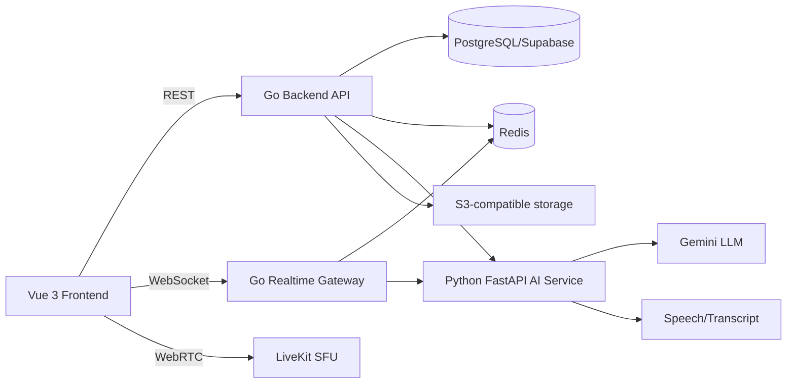
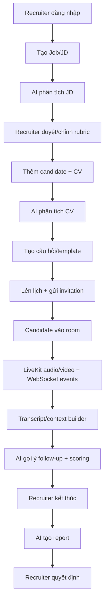
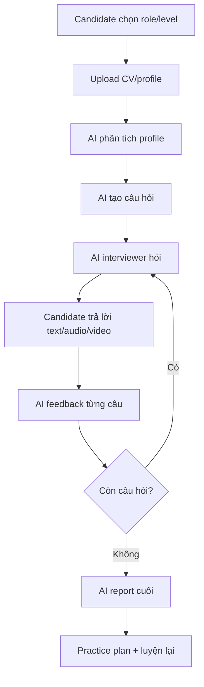

# Tài liệu phản biện dự án ViecLamAI

## 1. Giới thiệu và bài toán

ViecLamAI là nền tảng phỏng vấn trực tuyến tích hợp AI real-time. Hệ thống giải quyết hai bài toán:

1. **Tuyển dụng thật:** Recruiter tạo job/JD, quản lý ứng viên, tổ chức phòng phỏng vấn, nhận transcript, gợi ý câu hỏi, điểm số và báo cáo.
2. **Luyện phỏng vấn:** Candidate upload CV, chọn vị trí/level, luyện phỏng vấn với AI và nhận feedback cải thiện.

AI chỉ là trợ lý phân tích và đề xuất; quyết định tuyển dụng cuối cùng luôn thuộc về Recruiter.

## 2. Kiến trúc tổng thể



### Các thành phần kỹ thuật

- **Frontend:** Vue 3, TailwindCSS, Pinia, LiveKit SDK.
- **Backend Core:** Go, REST API, authentication, nghiệp vụ, PostgreSQL.
- **Backend Realtime:** Go, WebSocket, room events, transcript bridge.
- **AI Service:** Python FastAPI, Gemini, prompt/schema validation.
- **PostgreSQL/Supabase:** dữ liệu người dùng, công ty, job, CV, lịch, room, report.
- **Redis:** cache, health check, queue/event support.
- **LiveKit:** SFU cho audio/video; ứng dụng không tự xử lý media server.
- **S3-compatible storage:** lưu CV, file upload và recording nếu bật.
- **Docker Compose/Caddy:** đóng gói service, reverse proxy và HTTPS.

## 3. Ba actor nghiệp vụ

### 3.1 Recruiter / Nhà tuyển dụng

- Đăng ký/đăng nhập.
- Tạo company/workspace.
- Tạo và quản lý job/JD.
- Tạo rubric, template và question bank.
- Thêm ứng viên, upload CV, mời phỏng vấn.
- Lên lịch, bắt đầu/kết thúc room.
- Xem transcript, AI suggestion, score và report.
- Ghi chú nội bộ và quyết định pass/fail/pending/next round.

### 3.2 Candidate / Ứng viên

- Đăng ký/đăng nhập hoặc truy cập link mời.
- Cập nhật profile, upload CV.
- Nhận lịch và tham gia room.
- Dùng camera/micro/chat để phỏng vấn.
- Tham gia mock interview với AI.
- Xem feedback, lịch sử luyện tập và kế hoạch cải thiện.

### 3.3 Admin

- Quản lý user, role, company/workspace.
- Theo dõi logs/audit và tình trạng hệ thống.
- Quản lý AI settings/deployment configuration.
- Hỗ trợ kiểm soát dữ liệu, quyền truy cập và vận hành.

**AI không phải actor ra quyết định:** AI chỉ đưa recommendation có evidence/confidence.

## 4. Các module chính

### 4.1 Auth & Account

Đăng ký, đăng nhập, refresh token, đăng xuất, quên/đổi mật khẩu, profile và RBAC. Backend kiểm tra access token và quyền trước khi xử lý resource.

### 4.2 Company / Workspace

Recruiter tạo công ty, quản lý thành viên HR và phân quyền nội bộ. Job, candidate, interview và report thuộc workspace để tách dữ liệu giữa các công ty.

### 4.3 Job & JD Management

Tạo/sửa/mở/đóng job, nhập hoặc upload JD, gán level/department/location. JD là nguồn context cho AI phân tích, tạo rubric và tạo câu hỏi.

### 4.4 Candidate & CV

Thêm candidate, import, upload CV, gán vào job, theo dõi trạng thái:

`new → screening → invited → interviewing → completed → passed/rejected/talent_pool`.

CV được lưu private và có thể được AI parse thành structured profile.

### 4.5 Interview Template & Rubric

Template định nghĩa loại interview, thời lượng, câu hỏi, rubric và AI behavior. Rubric mặc định gồm Technical Knowledge 30%, Problem Solving 20%, Experience Relevance 20%, Communication 15%, Culture Fit 10%, Growth Mindset 5%.

### 4.6 Question Bank

Lưu câu hỏi thủ công hoặc câu hỏi do AI sinh; gắn theo job, skill, level, loại câu hỏi và đánh dấu bắt buộc/follow-up.

### 4.7 Scheduling & Invitation

Recruiter chọn job, candidate, interviewer và thời gian; hệ thống tạo invitation/room link, gửi email hoặc reminder, hỗ trợ đổi/hủy lịch.

### 4.8 Interview Room Realtime

Room có video/audio, chat, transcript, timer, CV/JD preview, question checklist, note panel, AI suggestion và score panel. LiveKit xử lý media; WebSocket truyền sự kiện nghiệp vụ/transcript/suggestion.

Trạng thái room:

`scheduled → waiting → candidate_joined/recruiter_joined → active → paused → completed`.

Có thể `cancelled` hoặc `expired`.

### 4.9 AI Interview Engine

Gồm JD analyzer, CV analyzer, question generator, follow-up suggestion, transcript/summarizer, scoring engine, report generator và mock interview coach.

### 4.10 Report & Analytics

Tổng hợp thông tin candidate/job, transcript, score theo rubric, strengths, weaknesses, risks, recommendation, evidence và next steps. Recruiter có thể xem theo buổi, candidate, job, so sánh và xuất PDF nếu chức năng được bật.

### 4.11 Mock Interview Portal

Candidate chọn role/level, cung cấp CV/profile, nhận câu hỏi AI, trả lời từng câu, nhận feedback từng câu và report cuối buổi; có thể luyện lại và theo dõi tiến bộ.

### 4.12 Audit, Storage, Notification

Audit ghi hoạt động quan trọng; storage giữ file private; notification phục vụ invitation/reminder và sự kiện room. Secret/API key không được đưa vào frontend hoặc commit Git.

## 5. Luồng tuyển dụng thật



1. Recruiter tạo job và JD.
2. AI tách required skills, nice-to-have, seniority, focus areas.
3. Recruiter kiểm tra và sửa rubric/câu hỏi.
4. Candidate được thêm và CV được phân tích.
5. Recruiter lên lịch, hệ thống tạo link.
6. Hai bên kiểm tra thiết bị và join room.
7. Media đi qua LiveKit; sự kiện/transcript đi qua realtime gateway.
8. AI dùng transcript gần nhất để gợi ý câu hỏi và score.
9. Khi kết thúc, full transcript + score dùng để tạo report.
10. Recruiter xem evidence và ra quyết định.

## 6. Luồng mock interview



## 7. AI hoạt động: input/output

### 7.1 AI endpoint nền tảng

AI Service cung cấp API generate. Input cơ bản:

```json
{
  "prompt": "prompt đã dựng từ context",
  "model": "gemini-2.5-flash",
  "temperature": 0.2,
  "max_tokens": 2000
}
```

Output là JSON/envelope gồm dữ liệu kết quả, evidence, confidence, model và token usage. Go backend chịu trách nhiệm gọi service, kiểm tra lỗi và lưu kết quả cần thiết.

### 7.2 Context chuẩn

```json
{
  "job": {"title":"", "description":"", "requirements":"", "level":"middle"},
  "candidate": {"full_name":"", "cv_summary":"", "parsed_cv":{}},
  "interview": {"mode":"real", "stage":"technical", "transcript":[], "questions_asked":[]},
  "rubric": {"criteria":[]},
  "constraints": {"language":"vi", "avoid_sensitive_attributes":true, "require_evidence":true}
}
```

Realtime chỉ gửi JD summary, CV summary, rubric, 10–20 transcript items gần nhất, câu hỏi đã hỏi và score hiện tại. Report cuối mới dùng full transcript để giảm latency và chi phí.

### 7.3 Phân tích JD

**Input:** JD text + title/level/department.

**Output:** summary, required skills, nice-to-have skills, seniority, missing information, focus areas, suggested rubric và suggested questions.

### 7.4 Phân tích CV

**Input:** CV text + job context.

**Output:** summary, skills kèm evidence/level hint, work experience, projects, education, strengths, concerns, questions to verify và confidence.

### 7.5 Sinh câu hỏi

**Input:** job/JD, CV summary, rubric, level, số lượng và loại câu hỏi.

**Output:** danh sách question text, type, target skill, difficulty, why ask, expected signals và red flags.

### 7.6 Follow-up realtime

**Input:** job, candidate summary, rubric, questions already asked, recent transcript.

**Output:** `should_ask`, suggested question, reason, target skill, question type, priority và confidence.

AI sẽ trả `should_ask=false` nếu chưa cần hỏi thêm; nếu câu trả lời mơ hồ, ưu tiên hỏi vai trò cá nhân, số liệu, bằng chứng và trade-off.

### 7.7 Chấm điểm

**Input:** JD, candidate summary, rubric criteria và transcript.

**Output:** mỗi criterion có score 1–5, max_score, status, evidence, comment, improvement suggestion và confidence.

Công thức:

```text
final_score = sum((score / max_score) * weight)
```

Nếu thiếu evidence:

```json
{
  "status": "insufficient_evidence",
  "score": null,
  "evidence": null,
  "confidence": 0.34
}
```

### 7.8 Report sau phỏng vấn

**Input:** job, candidate, rubric, full transcript, scores và recruiter notes.

**Output:** summary, final score, recommendation, reason, strengths/weaknesses/risks kèm evidence, scores chi tiết, next steps, insufficient data points và confidence.

Recommendation chỉ là `strong_hire|hire|consider|next_round|reject|insufficient_data`; Recruiter quyết định cuối.

### 7.9 Mock interviewer

**Input:** target role/level, candidate profile, lịch sử câu hỏi và câu trả lời.

**Output:** một câu hỏi tiếp theo gồm question id/text/type/target skill/difficulty.

### 7.10 Feedback mock

**Input:** question, answer và target role.

**Output:** score 1–5, strengths, improvements, sample better answer, coach comment và confidence.

### 7.11 Báo cáo mock cuối buổi

**Input:** role/level, toàn bộ Q&A và feedback từng câu.

**Output:** summary, final score, strengths, weaknesses, practice plan theo priority, recommended next mock type và encouragement.

## 8. Quy tắc an toàn AI cần trình bày

- AI không tự pass/reject, không gửi kết quả tuyển dụng và không đổi trạng thái nếu chưa được xác nhận.
- Mọi score/nhận xét quan trọng phải có evidence từ JD, CV, transcript, rubric hoặc note được phép.
- Không đủ dữ liệu thì score là `null`, status là `insufficient_evidence`.
- Có confidence 0–1 để người dùng biết mức tin cậy.
- Không đánh giá giới tính, tuổi, tôn giáo, dân tộc, ngoại hình, giọng vùng miền, hôn nhân, sức khỏe không cần thiết hay chính trị.
- Không suy diễn tính cách từ giọng nói, tên hoặc ngoại hình.
- Structured JSON giúp backend validate và frontend hiển thị ổn định.
- Khi AI provider lỗi: hiển thị trạng thái lỗi, retry có kiểm soát, không tạo score giả.
- API key và dữ liệu CV/transcript phải được bảo vệ; không log secret/token.

## 9. Câu hỏi phản biện và câu trả lời mẫu

### Q1. AI có thay thế recruiter không?
**Trả lời:** Không. AI chỉ phân tích, gợi ý và tổng hợp có evidence/confidence. Recruiter là người duyệt rubric, kiểm tra transcript và ra quyết định cuối.

### Q2. Vì sao tách Go Backend và Python AI Service?
**Trả lời:** Go phù hợp API nghiệp vụ, concurrency và realtime ổn định; Python có hệ sinh thái AI/LLM tốt. Tách service giúp độc lập scale, deploy và thay provider.

### Q3. AI lấy dữ liệu nào để chấm điểm?
**Trả lời:** JD, CV, rubric và transcript/câu trả lời. Realtime dùng cửa sổ transcript 10–20 message gần nhất; report cuối dùng full transcript.

### Q4. Làm sao hạn chế hallucination?
**Trả lời:** Prompt bắt buộc không bịa, output JSON, yêu cầu evidence, confidence và trạng thái insufficient_evidence. Backend validate schema; thiếu dữ liệu không được tự điền score.

### Q5. Làm sao hạn chế bias tuyển dụng?
**Trả lời:** Loại các thuộc tính nhạy cảm khỏi tiêu chí; chỉ đánh giá evidence liên quan JD như kỹ năng, cách giải quyết vấn đề và kết quả thực tế. AI không được suy diễn từ tên, tuổi, ngoại hình hay giọng.

### Q6. Vì sao dùng LiveKit?
**Trả lời:** LiveKit là SFU tối ưu cho audio/video realtime, giảm tải server ứng dụng. Backend chỉ quản lý room/token/sự kiện; media đi qua LiveKit.

### Q7. WebSocket khác LiveKit thế nào?
**Trả lời:** LiveKit xử lý media WebRTC. WebSocket xử lý sự kiện nghiệp vụ như join/leave, chat, transcript, suggestion, score và trạng thái room.

### Q8. Nếu Gemini lỗi thì sao?
**Trả lời:** AI service trả lỗi có kiểm soát; UI hiển thị unavailable/retry. Không tự sinh dữ liệu giả và không làm mất transcript hay trạng thái phỏng vấn.

### Q9. Chấm điểm tổng như thế nào?
**Trả lời:** Chuẩn hóa score theo max score rồi nhân trọng số rubric. Nếu evidence quá ít, recommendation là insufficient_data thay vì kết luận chắc chắn.

### Q10. Làm sao bảo vệ CV và transcript?
**Trả lời:** RBAC theo workspace, file storage private, URL tải có chữ ký/thời hạn, JWT/refresh token, HTTPS, không commit secret và hạn chế log dữ liệu nhạy cảm.

### Q11. Vì sao dùng Redis?
**Trả lời:** Redis hỗ trợ health check, cache và các event/queue async để tách tác vụ AI khỏi request realtime, giảm độ trễ.

### Q12. PostgreSQL/Supabase có vai trò gì?
**Trả lời:** Lưu dữ liệu bền vững: account, workspace, job, candidate, CV metadata, interview, transcript, score, report và audit.

### Q13. Nếu mạng yếu hoặc candidate rời room?
**Trả lời:** Room có trạng thái và presence; LiveKit hỗ trợ reconnect. Backend lưu event/transcript theo phiên để có thể tiếp tục hoặc đánh dấu gián đoạn.

### Q14. Vì sao AI suggestion không hiển thị cho candidate trong interview thật?
**Trả lời:** Đây là hỗ trợ nội bộ recruiter, tránh lộ rubric/chiến lược phỏng vấn và giữ tính công bằng. Candidate chỉ thấy những thành phần được cấu hình cho họ.

### Q15. Mock interview khác interview thật thế nào?
**Trả lời:** Interview thật có recruiter và AI assistant hỗ trợ recruiter; mock interview để AI đóng vai interviewer/coach và feedback trực tiếp cho candidate.

### Q16. Có thể đổi Gemini sang provider khác không?
**Trả lời:** Có. AI service được tách khỏi backend và có lớp generate/provider adapter; chỉ cần giữ contract input/output và thay client/model.

### Q17. Đo hiệu quả hệ thống bằng gì?
**Trả lời:** Thời gian tạo JD/câu hỏi, thời gian sàng lọc, độ đầy đủ transcript, latency suggestion, tỷ lệ lỗi AI, mức độ evidence, độ nhất quán score và feedback người dùng.

### Q18. Hạn chế hiện tại là gì?
**Trả lời:** AI phụ thuộc chất lượng transcript, chất lượng JD/CV và quota/provider; WebRTC cần mạng tốt; recommendation không thể thay thế phỏng vấn và kiểm chứng của con người.

## 10. Kịch bản demo 5 phút

1. Đăng nhập Recruiter.
2. Tạo job và nhập JD.
3. Chạy phân tích JD, trình bày required skills và rubric.
4. Tạo candidate và upload CV, trình bày CV analysis/evidence.
5. Sinh question bank.
6. Tạo lịch và mở interview room.
7. Cho thấy audio/video, chat, transcript và AI follow-up.
8. Kết thúc room, mở score/report.
9. Chuyển sang Candidate mock portal.
10. Chọn role, trả lời 1–2 câu và xem feedback/practice plan.
11. Kết luận: AI hỗ trợ quyết định, không quyết định thay người.

## 11. Thông điệp kết luận

ViecLamAI kết nối toàn bộ quy trình từ JD → CV → câu hỏi → phòng phỏng vấn → transcript → AI suggestion/scoring → report → quyết định recruiter. Điểm khác biệt là AI hoạt động trong bối cảnh nghiệp vụ cụ thể, output có cấu trúc, evidence và confidence, đồng thời có cơ chế bảo vệ dữ liệu và chống bias.
