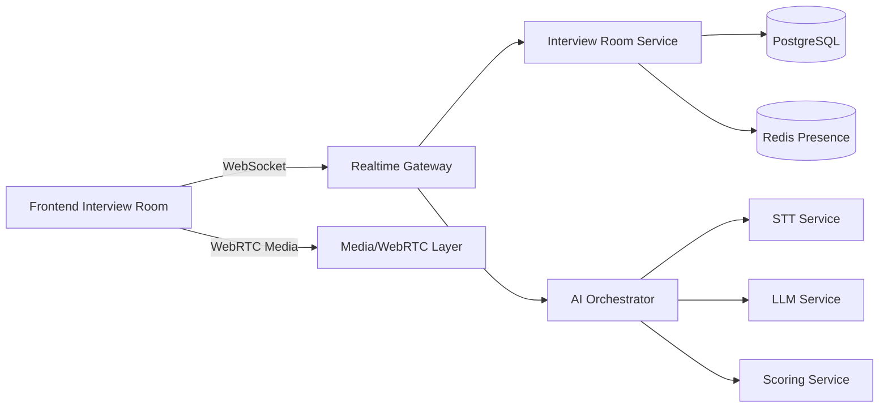
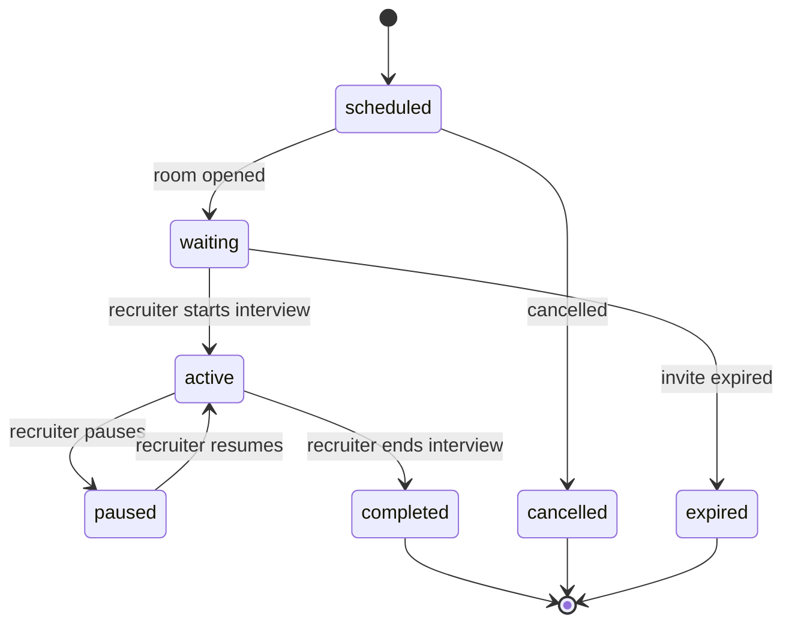
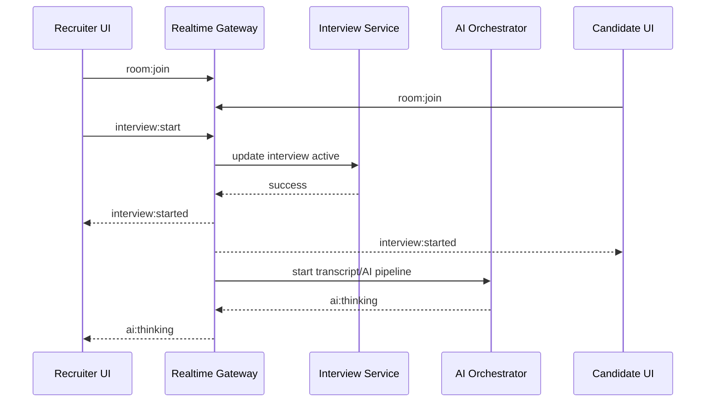
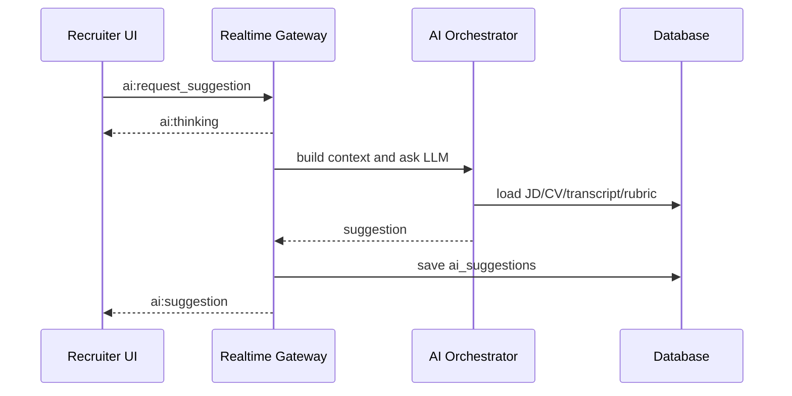
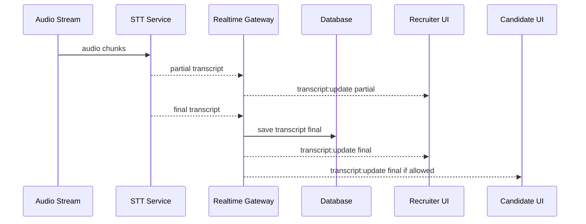

# REALTIME_EVENTS.md
# Đặc tả realtime events — AI Interview Platform

## 0. Mục đích tài liệu

Tài liệu này định nghĩa toàn bộ realtime contract cho phòng phỏng vấn.

AI IDE của Hùng, Khôi, Lai phải dùng file này khi làm:

- WebSocket gateway.
- Interview room.
- Chat realtime.
- Presence.
- Transcript realtime.
- AI suggestion realtime.
- AI scoring realtime.
- WebRTC signaling.
- Reconnect khi mất mạng.

---

## 1. Kiến trúc realtime đề xuất



MVP có thể dùng WebSocket cho:

- Presence.
- Chat.
- Room state.
- Transcript text.
- AI suggestion.
- AI scoring.
- WebRTC signaling nếu tự triển khai peer connection.

Nếu dùng provider video call bên ngoài, WebSocket vẫn giữ room state và AI events.

---

## 2. Realtime connection

## 2.1. WebSocket URL

```text
wss://api.example.com/ws/interview-room
```

Local:

```text
ws://localhost:8080/ws/interview-room
```

---

## 2.2. Authentication khi connect

Client gửi token bằng query hoặc header.

Option 1:

```text
wss://api.example.com/ws/interview-room?token=<room_access_token>
```

Option 2:

```http
Authorization: Bearer <room_access_token>
```

Room access token được lấy từ:

```http
POST /api/v1/companies/:company_id/interviews/:interview_id/room/token
```

hoặc candidate invite:

```http
GET /api/v1/interviews/join/:invite_token
```

---

## 2.3. Event envelope chuẩn

Mọi message qua WebSocket dùng format:

```json
{
  "event": "room:join",
  "request_id": "uuid-or-client-generated-id",
  "room_id": "uuid",
  "interview_id": "uuid",
  "sent_at": "2026-06-23T09:00:00Z",
  "payload": {}
}
```

Server response có thể thêm:

```json
{
  "event": "room:joined",
  "request_id": "same-as-client-request-if-response",
  "room_id": "uuid",
  "interview_id": "uuid",
  "server_time": "2026-06-23T09:00:01Z",
  "payload": {}
}
```

---

## 2.4. Event naming convention

Dùng dạng:

```text
domain:action
```

Ví dụ:

- `room:join`
- `chat:send`
- `transcript:update`
- `ai:suggestion`
- `rtc:offer`

---

## 3. Room lifecycle



---

## 4. Client to Server events

## 4.1. room:join

Client gửi khi user vào room.

```json
{
  "event": "room:join",
  "request_id": "req_001",
  "room_id": "uuid",
  "interview_id": "uuid",
  "payload": {
    "participant_type": "recruiter",
    "display_name": "Nguyễn Văn A",
    "device_info": {
      "browser": "Chrome",
      "os": "Windows"
    }
  }
}
```

Rules:

- Server validate room_access_token.
- Server check participant permission.
- Server tạo/cập nhật participant presence.
- Server broadcast `room:user_joined`.

---

## 4.2. room:leave

```json
{
  "event": "room:leave",
  "request_id": "req_002",
  "room_id": "uuid",
  "interview_id": "uuid",
  "payload": {
    "reason": "user_clicked_leave"
  }
}
```

---

## 4.3. room:heartbeat

Client gửi định kỳ mỗi 15-30 giây.

```json
{
  "event": "room:heartbeat",
  "request_id": "req_003",
  "room_id": "uuid",
  "interview_id": "uuid",
  "payload": {
    "connection_state": "online"
  }
}
```

Server dùng để cập nhật `last_seen_at`.

---

## 4.4. interview:start

Recruiter gửi khi bắt đầu phỏng vấn.

```json
{
  "event": "interview:start",
  "request_id": "req_004",
  "room_id": "uuid",
  "interview_id": "uuid",
  "payload": {
    "consent_recording": true,
    "consent_ai": true
  }
}
```

Permission:

- Chỉ recruiter assigned hoặc admin.

Server xử lý:

- Update interview status = active.
- Set started_at.
- Broadcast `interview:started`.
- Start transcript/AI pipeline nếu consent cho phép.

---

## 4.5. interview:end

```json
{
  "event": "interview:end",
  "request_id": "req_005",
  "room_id": "uuid",
  "interview_id": "uuid",
  "payload": {
    "generate_report": true
  }
}
```

Server xử lý:

- Update status = completed.
- Set ended_at.
- Broadcast `interview:completed`.
- Trigger report generation.
- Close room sau grace period.

---

## 4.6. media:status

Client gửi khi mic/camera/screen share đổi trạng thái.

```json
{
  "event": "media:status",
  "request_id": "req_006",
  "room_id": "uuid",
  "interview_id": "uuid",
  "payload": {
    "mic_enabled": true,
    "camera_enabled": false,
    "screen_sharing": false
  }
}
```

Server broadcast `media:status_changed`.

---

## 4.7. chat:send

```json
{
  "event": "chat:send",
  "request_id": "req_007",
  "room_id": "uuid",
  "interview_id": "uuid",
  "payload": {
    "message": "Bạn có thể chia sẻ màn hình không?",
    "visibility": "room"
  }
}
```

Visibility:

- `room`: tất cả participant được xem.
- `recruiter_only`: chỉ recruiter/internal, candidate không thấy.

---

## 4.8. note:create

Recruiter tạo note nội bộ.

```json
{
  "event": "note:create",
  "request_id": "req_008",
  "room_id": "uuid",
  "interview_id": "uuid",
  "payload": {
    "content": "Ứng viên trả lời tốt phần Vue nhưng chưa rõ testing.",
    "tags": ["technical", "follow_up"]
  }
}
```

Permission:

- Recruiter only.

Candidate không nhận event này.

---

## 4.9. question:mark_asked

Recruiter đánh dấu câu hỏi đã hỏi.

```json
{
  "event": "question:mark_asked",
  "request_id": "req_009",
  "room_id": "uuid",
  "interview_id": "uuid",
  "payload": {
    "question_id": "uuid",
    "asked_at_ms": 320000
  }
}
```

---

## 4.10. transcript:partial

Client/STT gateway gửi transcript tạm thời nếu frontend stream audio.

```json
{
  "event": "transcript:partial",
  "request_id": "req_010",
  "room_id": "uuid",
  "interview_id": "uuid",
  "payload": {
    "speaker_type": "candidate",
    "content": "Tôi từng làm dự án...",
    "start_time_ms": 120000,
    "end_time_ms": 123000,
    "confidence": 0.76
  }
}
```

Note:

- Ở MVP, STT có thể chạy server-side và client không cần gửi event này.

---

## 4.11. transcript:final

```json
{
  "event": "transcript:final",
  "request_id": "req_011",
  "room_id": "uuid",
  "interview_id": "uuid",
  "payload": {
    "speaker_type": "candidate",
    "content": "Tôi từng làm dự án thương mại điện tử bằng Vue 3.",
    "start_time_ms": 120000,
    "end_time_ms": 128000,
    "confidence": 0.91
  }
}
```

Server lưu vào DB và broadcast `transcript:update`.

---

## 4.12. ai:request_suggestion

Recruiter yêu cầu AI gợi ý câu hỏi.

```json
{
  "event": "ai:request_suggestion",
  "request_id": "req_012",
  "room_id": "uuid",
  "interview_id": "uuid",
  "payload": {
    "focus": "technical_depth",
    "last_transcript_id": "uuid"
  }
}
```

Server phản hồi:

- `ai:thinking`
- `ai:suggestion`
- hoặc `ai:error`

---

## 4.13. ai:request_score_update

Recruiter hoặc system yêu cầu AI cập nhật score realtime.

```json
{
  "event": "ai:request_score_update",
  "request_id": "req_013",
  "room_id": "uuid",
  "interview_id": "uuid",
  "payload": {
    "criterion_ids": ["uuid"],
    "scope": "latest_answer"
  }
}
```

---

## 4.14. rtc:offer

Dùng nếu tự triển khai WebRTC signaling.

```json
{
  "event": "rtc:offer",
  "request_id": "req_014",
  "room_id": "uuid",
  "interview_id": "uuid",
  "payload": {
    "to_participant_id": "uuid",
    "sdp": "..."
  }
}
```

---

## 4.15. rtc:answer

```json
{
  "event": "rtc:answer",
  "request_id": "req_015",
  "room_id": "uuid",
  "interview_id": "uuid",
  "payload": {
    "to_participant_id": "uuid",
    "sdp": "..."
  }
}
```

---

## 4.16. rtc:ice_candidate

```json
{
  "event": "rtc:ice_candidate",
  "request_id": "req_016",
  "room_id": "uuid",
  "interview_id": "uuid",
  "payload": {
    "to_participant_id": "uuid",
    "candidate": {}
  }
}
```

---

## 5. Server to Client events

## 5.1. room:joined

```json
{
  "event": "room:joined",
  "request_id": "req_001",
  "room_id": "uuid",
  "interview_id": "uuid",
  "payload": {
    "participant_id": "uuid",
    "room_status": "waiting",
    "participants": [
      {
        "participant_id": "uuid",
        "display_name": "Nguyễn Văn A",
        "participant_type": "recruiter",
        "connection_state": "online",
        "media_status": {
          "mic_enabled": true,
          "camera_enabled": true
        }
      }
    ]
  }
}
```

---

## 5.2. room:user_joined

```json
{
  "event": "room:user_joined",
  "room_id": "uuid",
  "interview_id": "uuid",
  "payload": {
    "participant_id": "uuid",
    "display_name": "Trần Văn B",
    "participant_type": "candidate",
    "joined_at": "2026-06-23T09:00:00Z"
  }
}
```

---

## 5.3. room:user_left

```json
{
  "event": "room:user_left",
  "room_id": "uuid",
  "interview_id": "uuid",
  "payload": {
    "participant_id": "uuid",
    "reason": "connection_closed",
    "left_at": "2026-06-23T09:10:00Z"
  }
}
```

---

## 5.4. room:presence_update

```json
{
  "event": "room:presence_update",
  "room_id": "uuid",
  "interview_id": "uuid",
  "payload": {
    "participants": []
  }
}
```

---

## 5.5. interview:started

```json
{
  "event": "interview:started",
  "room_id": "uuid",
  "interview_id": "uuid",
  "payload": {
    "status": "active",
    "started_at": "2026-06-23T09:00:00Z",
    "transcript_enabled": true,
    "ai_enabled": true
  }
}
```

---

## 5.6. interview:completed

```json
{
  "event": "interview:completed",
  "room_id": "uuid",
  "interview_id": "uuid",
  "payload": {
    "status": "completed",
    "ended_at": "2026-06-23T10:00:00Z",
    "report_status": "generating"
  }
}
```

---

## 5.7. media:status_changed

```json
{
  "event": "media:status_changed",
  "room_id": "uuid",
  "interview_id": "uuid",
  "payload": {
    "participant_id": "uuid",
    "mic_enabled": true,
    "camera_enabled": false,
    "screen_sharing": false
  }
}
```

---

## 5.8. chat:message

```json
{
  "event": "chat:message",
  "room_id": "uuid",
  "interview_id": "uuid",
  "payload": {
    "message_id": "uuid",
    "sender_participant_id": "uuid",
    "sender_name": "Nguyễn Văn A",
    "sender_type": "recruiter",
    "message": "Bạn có thể chia sẻ màn hình không?",
    "created_at": "2026-06-23T09:05:00Z"
  }
}
```

---

## 5.9. transcript:update

Server gửi khi có transcript partial/final.

```json
{
  "event": "transcript:update",
  "room_id": "uuid",
  "interview_id": "uuid",
  "payload": {
    "transcript_id": "uuid",
    "speaker_type": "candidate",
    "speaker_name": "Trần Văn B",
    "content": "Tôi từng làm dự án thương mại điện tử bằng Vue 3.",
    "start_time_ms": 120000,
    "end_time_ms": 128000,
    "confidence": 0.91,
    "is_final": true,
    "created_at": "2026-06-23T09:08:00Z"
  }
}
```

Visibility:

- Recruiter: luôn thấy.
- Candidate: tùy cấu hình room.

---

## 5.10. ai:thinking

```json
{
  "event": "ai:thinking",
  "room_id": "uuid",
  "interview_id": "uuid",
  "payload": {
    "task": "suggest_follow_up",
    "message": "AI đang phân tích câu trả lời..."
  }
}
```

Visibility:

- Recruiter only, trừ mock interview.

---

## 5.11. ai:suggestion

```json
{
  "event": "ai:suggestion",
  "room_id": "uuid",
  "interview_id": "uuid",
  "payload": {
    "suggestion_id": "uuid",
    "suggestion_type": "follow_up_question",
    "content": "Bạn có thể nói rõ bạn đã đo performance bằng chỉ số nào không?",
    "reason": "Ứng viên nói đã tối ưu performance nhưng chưa nêu metric cụ thể.",
    "target_skill": "Performance Optimization",
    "priority": "high",
    "confidence": 0.84
  }
}
```

Visibility:

- Recruiter only trong phỏng vấn thật.
- Candidate có thể thấy trong mock interview.

---

## 5.12. ai:score_update

```json
{
  "event": "ai:score_update",
  "room_id": "uuid",
  "interview_id": "uuid",
  "payload": {
    "scores": [
      {
        "criterion_name": "Technical Knowledge",
        "score": 4,
        "max_score": 5,
        "evidence": "Ứng viên mô tả được cách tối ưu query và cache.",
        "confidence": 0.78,
        "status": "scored"
      }
    ]
  }
}
```

Visibility:

- Recruiter only.

---

## 5.13. ai:warning

```json
{
  "event": "ai:warning",
  "room_id": "uuid",
  "interview_id": "uuid",
  "payload": {
    "warning_type": "insufficient_evidence",
    "message": "Chưa đủ dữ liệu để đánh giá tiêu chí Problem Solving.",
    "suggested_action": "Hãy hỏi thêm một câu tình huống giải quyết vấn đề."
  }
}
```

---

## 5.14. report:ready

```json
{
  "event": "report:ready",
  "room_id": "uuid",
  "interview_id": "uuid",
  "payload": {
    "report_id": "uuid",
    "final_score": 78.5,
    "recommendation": "consider"
  }
}
```

Visibility:

- Recruiter only.

---

## 5.15. error

```json
{
  "event": "error",
  "request_id": "req_012",
  "room_id": "uuid",
  "interview_id": "uuid",
  "payload": {
    "code": "AI_SERVICE_ERROR",
    "message": "AI tạm thời không phản hồi. Buổi phỏng vấn vẫn tiếp tục.",
    "recoverable": true
  }
}
```

---

## 6. Visibility rules

| Event | Recruiter | Candidate | Ghi chú |
|---|---:|---:|---|
| room:user_joined | Có | Có | Presence chung |
| room:user_left | Có | Có | Presence chung |
| media:status_changed | Có | Có | Trạng thái thiết bị |
| chat:message room | Có | Có | Chat chung |
| note:create result | Có | Không | Note nội bộ |
| transcript:update | Có | Tùy cấu hình | Có thể bật/tắt cho candidate |
| ai:suggestion | Có | Không | Trong phỏng vấn thật |
| ai:score_update | Có | Không | Nội bộ recruiter |
| ai:warning | Có | Không | Nội bộ recruiter |
| report:ready | Có | Không | Nội bộ recruiter |

---

## 7. Reconnect policy

## 7.1. Mất mạng ngắn

Nếu user mất kết nối dưới 2 phút:

- Server giữ participant state = `reconnecting`.
- Khi reconnect thành công, gửi `room:joined` lại với current state.
- Client sync transcript mới bằng REST hoặc event backlog.

## 7.2. Mất mạng lâu

Nếu mất kết nối quá 2 phút:

- Participant state = `offline`.
- Broadcast `room:user_left` hoặc `room:presence_update`.
- User vẫn có thể vào lại nếu interview chưa completed/expired.

---

## 8. Idempotency và ordering

- Client phải gửi `request_id` cho event quan trọng.
- Server nên bỏ qua duplicate `request_id` trong một khoảng thời gian ngắn.
- Event transcript cần có `created_at` và `start_time_ms` để client sort.
- Event `interview:end` nếu gửi nhiều lần chỉ được xử lý một lần.

---

## 9. Rate limit realtime

Đề xuất MVP:

| Event | Limit |
|---|---:|
| room:heartbeat | 1 lần / 10 giây |
| chat:send | 10 tin / phút / participant |
| ai:request_suggestion | 10 lần / 10 phút / interview |
| ai:request_score_update | 10 lần / 10 phút / interview |
| media:status | 30 lần / phút / participant |

---

## 10. Sequence: recruiter bắt đầu phỏng vấn



---

## 11. Sequence: AI gợi ý câu hỏi



---

## 12. Sequence: transcript realtime



---

## 13. DoD realtime

Realtime được xem là đạt khi:

- Join room hoạt động cho recruiter và candidate.
- Presence update đúng khi join/leave/reconnect.
- Start/end interview đồng bộ cả hai màn hình.
- Chat gửi/nhận realtime.
- Transcript update hiển thị realtime.
- AI suggestion hiển thị cho recruiter only.
- AI scoring không lộ cho candidate.
- Reconnect không làm mất toàn bộ state.
- Event error hiển thị thân thiện.
- Backend lưu transcript/suggestion/score vào DB khi cần.

---

## 14. Quy tắc cho AI IDE

Khi AI IDE code realtime:

1. Không đổi tên event nếu chưa cập nhật tài liệu này.
2. Mọi event phải dùng envelope chuẩn.
3. Event nội bộ recruiter không được gửi cho candidate.
4. `interview:end` phải idempotent.
5. Candidate reconnect phải kiểm tra invite/token còn hợp lệ.
6. AI lỗi không được làm room bị crash.
7. Nếu transcript confidence thấp, UI phải có trạng thái cảnh báo.
8. Nếu WebRTC chưa làm xong, vẫn phải giữ được room state/chat/AI events bằng WebSocket.
