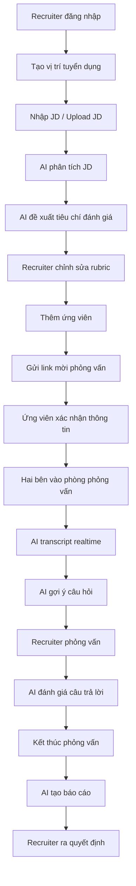
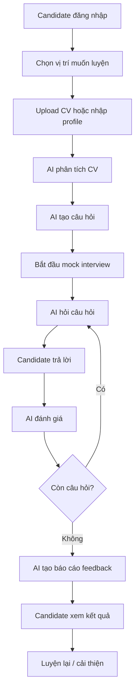
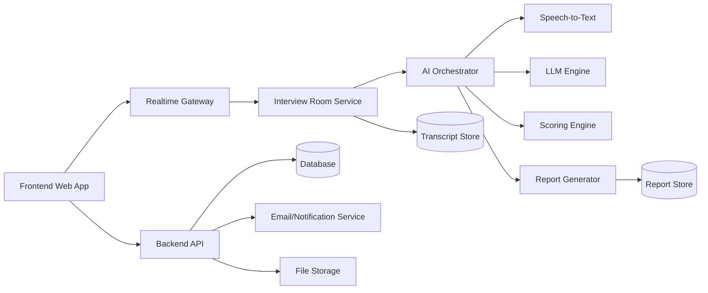
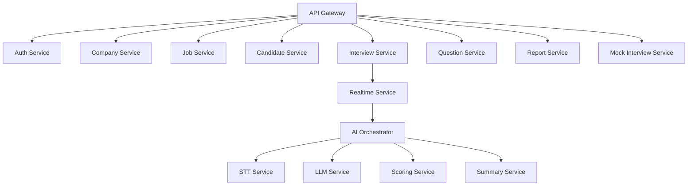
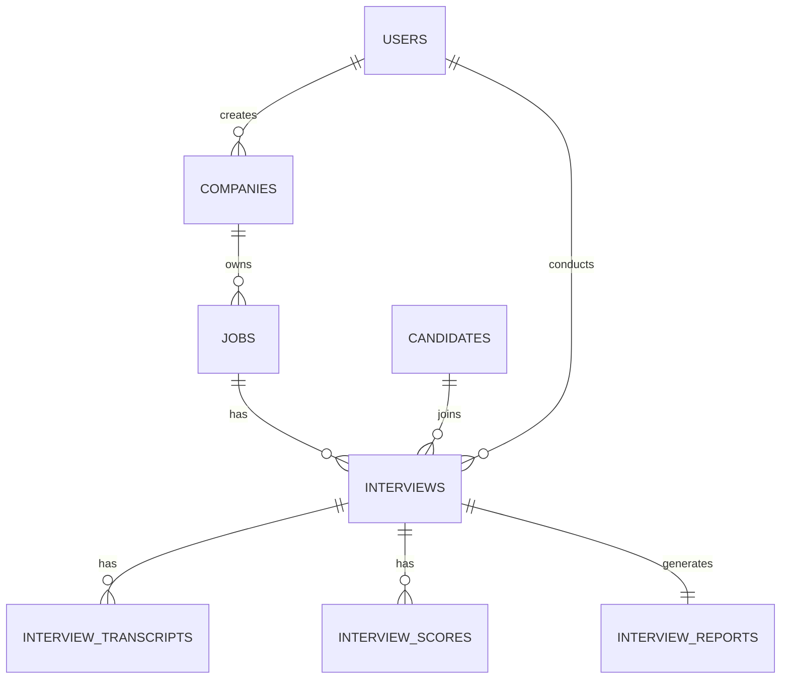

# SYSTEM_ANALYSIS.md

# Phân tích hệ thống: Nền tảng phỏng vấn cùng AI real-time

## 1. Tổng quan hệ thống

Hệ thống là một nền tảng phỏng vấn trực tuyến có tích hợp AI real-time trong phòng phỏng vấn. Trong một phòng phỏng vấn sẽ có 2 actor chính:

1. **Tuyển dụng / Recruiter**
2. **Ứng viên / Candidate**

AI không được xem là actor nghiệp vụ chính, mà là **trợ lý thông minh trong phòng phỏng vấn**, hỗ trợ theo dõi nội dung trao đổi, gợi ý câu hỏi, ghi nhận transcript, đánh giá câu trả lời, tạo báo cáo và hỗ trợ ứng viên luyện phỏng vấn thử.

Hệ thống có 2 mục đích lớn:

* **Mục đích 1: Hỗ trợ nhà tuyển dụng lọc ứng viên**

  * Tạo buổi phỏng vấn thật.
  * Theo dõi ứng viên trong thời gian thực.
  * AI gợi ý câu hỏi theo JD.
  * AI chấm điểm theo tiêu chí.
  * Tạo báo cáo sau phỏng vấn.
  * So sánh nhiều ứng viên cho cùng một vị trí.

* **Mục đích 2: Cho ứng viên phỏng vấn thử**

  * Ứng viên luyện phỏng vấn với AI.
  * AI đóng vai interviewer giả lập.
  * AI đặt câu hỏi theo vị trí ứng tuyển.
  * AI nhận xét điểm mạnh, điểm yếu.
  * AI đưa lời khuyên cải thiện CV, kỹ năng trả lời và phong thái.

---

## 2. Bài toán cần giải quyết

### 2.1. Vấn đề của nhà tuyển dụng

Nhà tuyển dụng thường gặp các vấn đề:

* Tốn nhiều thời gian sàng lọc ứng viên.
* Khó đánh giá đồng đều giữa nhiều ứng viên.
* Phỏng vấn phụ thuộc nhiều vào cảm tính.
* Không có transcript đầy đủ sau buổi phỏng vấn.
* Khó tổng hợp điểm mạnh, điểm yếu của từng ứng viên.
* Khó chuẩn hóa bộ câu hỏi theo từng vị trí.
* Khó theo dõi lịch sử phỏng vấn và so sánh ứng viên.
* Với số lượng ứng viên lớn, đội HR dễ bị quá tải.

### 2.2. Vấn đề của ứng viên

Ứng viên thường gặp các vấn đề:

* Thiếu môi trường luyện phỏng vấn thực tế.
* Không biết mình trả lời tốt hay chưa.
* Không biết điểm yếu trong cách trình bày.
* Không biết câu hỏi thường gặp theo vị trí ứng tuyển.
* Không có feedback chi tiết sau khi luyện tập.
* Dễ mất tự tin khi bước vào phỏng vấn thật.

### 2.3. Giải pháp hệ thống

Hệ thống cung cấp một nền tảng phỏng vấn có AI hỗ trợ real-time, giúp:

* Tạo phòng phỏng vấn online.
* Ghi âm, ghi hình hoặc transcript cuộc phỏng vấn.
* AI phân tích câu trả lời theo thời gian thực.
* AI gợi ý câu hỏi tiếp theo cho recruiter.
* AI chấm điểm ứng viên theo rubric.
* AI tạo báo cáo sau buổi phỏng vấn.
* Ứng viên có thể tự luyện phỏng vấn thử với AI.
* Nhà tuyển dụng có thể lọc ứng viên nhanh hơn và nhất quán hơn.

---

## 3. Mục tiêu sản phẩm

### 3.1. Mục tiêu nghiệp vụ

| Mục tiêu                | Mô tả                                                |
| ----------------------- | ---------------------------------------------------- |
| Tăng tốc tuyển dụng     | Giảm thời gian phỏng vấn và sàng lọc ứng viên        |
| Chuẩn hóa đánh giá      | Dùng bộ tiêu chí thống nhất cho từng vị trí          |
| Tăng chất lượng dữ liệu | Có transcript, điểm số, nhận xét, báo cáo            |
| Hỗ trợ quyết định       | Gợi ý mức độ phù hợp của ứng viên                    |
| Hỗ trợ ứng viên         | Tạo môi trường luyện phỏng vấn thử                   |
| Tối ưu quy trình HR     | Quản lý JD, ứng viên, lịch, phòng phỏng vấn, báo cáo |

### 3.2. Mục tiêu kỹ thuật

| Mục tiêu    | Mô tả                                                       |
| ----------- | ----------------------------------------------------------- |
| Realtime    | Phòng phỏng vấn hỗ trợ audio/video/chat/transcript realtime |
| AI realtime | AI phân tích nội dung trong quá trình phỏng vấn             |
| Scalable    | Có thể mở rộng cho nhiều công ty, nhiều phòng phỏng vấn     |
| Secure      | Bảo vệ dữ liệu ứng viên và nhà tuyển dụng                   |
| Modular     | Tách rõ module HR, Interview, AI, Report, Candidate Portal  |
| Audit       | Có log hoạt động quan trọng                                 |
| Extensible  | Dễ mở rộng thêm coding test, personality test, assessment   |

---

## 4. Actor chính

## 4.1. Recruiter / Nhà tuyển dụng

Recruiter là người tạo, quản lý và thực hiện buổi phỏng vấn.

### Quyền chính

* Đăng nhập hệ thống.
* Tạo công ty / workspace tuyển dụng.
* Tạo vị trí tuyển dụng.
* Tạo JD.
* Tạo bộ câu hỏi phỏng vấn.
* Mời ứng viên vào phòng phỏng vấn.
* Bắt đầu / kết thúc buổi phỏng vấn.
* Xem transcript realtime.
* Nhận gợi ý câu hỏi từ AI.
* Xem điểm đánh giá của AI.
* Ghi chú thủ công trong buổi phỏng vấn.
* Xem báo cáo sau phỏng vấn.
* So sánh nhiều ứng viên.
* Đưa quyết định: pass, fail, pending, next round.

### Nhu cầu chính

* Lọc ứng viên nhanh.
* Có đánh giá khách quan hơn.
* Tiết kiệm thời gian phỏng vấn.
* Có báo cáo rõ ràng.
* Dễ chia sẻ kết quả cho team nội bộ.

---

## 4.2. Candidate / Ứng viên

Candidate là người tham gia phỏng vấn thật hoặc luyện phỏng vấn thử.

### Quyền chính

* Nhận link mời phỏng vấn.
* Xác nhận thông tin cá nhân.
* Upload CV.
* Tham gia phòng phỏng vấn.
* Bật/tắt camera, micro nếu được phép.
* Trả lời câu hỏi.
* Nhắn tin trong phòng.
* Xem kết quả mock interview nếu là phỏng vấn thử.
* Nhận feedback cải thiện.
* Xem lịch sử luyện phỏng vấn của mình.

### Nhu cầu chính

* Tham gia phỏng vấn dễ dàng.
* Không cần cài phần mềm phức tạp.
* Được luyện tập trước phỏng vấn thật.
* Nhận feedback rõ ràng.
* Biết cách cải thiện câu trả lời.

---

## 5. AI trong hệ thống

AI là thành phần hỗ trợ thông minh, có mặt trong phòng phỏng vấn dưới dạng:

* AI Assistant cho recruiter.
* AI Interviewer cho mock interview.
* AI Scoring Engine.
* AI Transcript Summarizer.
* AI Report Generator.
* AI Question Generator.
* AI Candidate Coach.

AI không thay thế hoàn toàn con người trong quyết định tuyển dụng. AI chỉ đóng vai trò hỗ trợ phân tích, đề xuất, gợi ý và tổng hợp.

---

## 6. Phạm vi hệ thống

## 6.1. Phân hệ dành cho tuyển dụng thật

### Chức năng chính

* Quản lý vị trí tuyển dụng.
* Quản lý ứng viên.
* Tạo lịch phỏng vấn.
* Tạo phòng phỏng vấn real-time.
* AI nghe và phân tích nội dung phỏng vấn.
* AI gợi ý câu hỏi tiếp theo.
* AI chấm điểm theo tiêu chí.
* Tạo báo cáo sau buổi phỏng vấn.
* So sánh ứng viên.

### Ví dụ luồng

1. Recruiter tạo vị trí “Frontend Developer”.
2. Recruiter nhập JD hoặc upload JD.
3. AI đề xuất bộ tiêu chí đánh giá.
4. Recruiter chỉnh sửa bộ tiêu chí.
5. Recruiter mời ứng viên.
6. Ứng viên nhận link và tham gia phòng.
7. Buổi phỏng vấn diễn ra.
8. AI ghi transcript và phân tích câu trả lời.
9. Recruiter nhận gợi ý câu hỏi.
10. Kết thúc buổi phỏng vấn.
11. AI tạo báo cáo tổng hợp.
12. Recruiter đưa quyết định.

---

## 6.2. Phân hệ phỏng vấn thử cho ứng viên

### Chức năng chính

* Ứng viên chọn vị trí muốn luyện tập.
* Upload CV hoặc nhập kinh nghiệm.
* AI tạo kịch bản phỏng vấn.
* AI đóng vai nhà tuyển dụng.
* Ứng viên trả lời bằng text/audio/video.
* AI đánh giá từng câu trả lời.
* AI tạo báo cáo điểm mạnh, điểm yếu.
* AI gợi ý câu trả lời tốt hơn.
* Ứng viên có thể luyện nhiều lần.

### Ví dụ luồng

1. Ứng viên chọn “Backend Developer”.
2. Ứng viên upload CV.
3. AI phân tích CV.
4. AI tạo bộ câu hỏi phù hợp.
5. Ứng viên bắt đầu mock interview.
6. AI hỏi từng câu.
7. Ứng viên trả lời.
8. AI phản hồi sau mỗi câu hoặc cuối buổi.
9. Ứng viên nhận điểm số và lời khuyên.
10. Ứng viên luyện lại nếu muốn.

---

## 7. Use Case tổng quan

| Mã   | Use Case                 | Actor                | Mô tả                           |
| ---- | ------------------------ | -------------------- | ------------------------------- |
| UC01 | Đăng ký / đăng nhập      | Recruiter, Candidate | Người dùng truy cập hệ thống    |
| UC02 | Tạo vị trí tuyển dụng    | Recruiter            | Tạo job cần phỏng vấn           |
| UC03 | Tạo bộ câu hỏi           | Recruiter, AI        | AI gợi ý câu hỏi theo JD        |
| UC04 | Mời ứng viên             | Recruiter            | Gửi link phỏng vấn              |
| UC05 | Tham gia phòng phỏng vấn | Recruiter, Candidate | Hai bên vào phòng realtime      |
| UC06 | Transcript realtime      | AI                   | Chuyển giọng nói thành văn bản  |
| UC07 | AI gợi ý câu hỏi         | AI, Recruiter        | AI đề xuất câu hỏi tiếp theo    |
| UC08 | AI chấm điểm             | AI                   | Đánh giá câu trả lời            |
| UC09 | Ghi chú thủ công         | Recruiter            | Recruiter ghi nhận xét riêng    |
| UC10 | Kết thúc phỏng vấn       | Recruiter            | Đóng phiên phỏng vấn            |
| UC11 | Tạo báo cáo              | AI                   | Tổng hợp kết quả                |
| UC12 | Xem báo cáo              | Recruiter            | Xem điểm, nhận xét, transcript  |
| UC13 | Mock interview           | Candidate, AI        | Ứng viên luyện phỏng vấn thử    |
| UC14 | Feedback ứng viên        | AI                   | AI đưa nhận xét cải thiện       |
| UC15 | So sánh ứng viên         | Recruiter            | So sánh nhiều ứng viên cùng job |

---

## 8. Luồng nghiệp vụ chi tiết

## 8.1. Luồng tuyển dụng thật



---

## 8.2. Luồng phỏng vấn thử



---

## 9. Phòng phỏng vấn real-time

## 9.1. Thành phần trong phòng

Một phòng phỏng vấn gồm:

| Thành phần       | Mô tả                                 |
| ---------------- | ------------------------------------- |
| Video call       | Recruiter và Candidate nhìn thấy nhau |
| Audio call       | Hai bên trao đổi trực tiếp            |
| Chat             | Gửi tin nhắn trong phòng              |
| AI panel         | Hiển thị gợi ý, phân tích, cảnh báo   |
| Transcript panel | Văn bản hội thoại realtime            |
| Question panel   | Danh sách câu hỏi cần hỏi             |
| Note panel       | Recruiter ghi chú thủ công            |
| Score panel      | AI chấm điểm từng tiêu chí            |
| Timeline         | Lịch sử sự kiện trong buổi phỏng vấn  |

---

## 9.2. Trạng thái phòng phỏng vấn

| Trạng thái       | Mô tả                       |
| ---------------- | --------------------------- |
| scheduled        | Đã lên lịch                 |
| waiting          | Đang chờ người tham gia     |
| candidate_joined | Ứng viên đã vào             |
| recruiter_joined | Recruiter đã vào            |
| active           | Buổi phỏng vấn đang diễn ra |
| paused           | Tạm dừng                    |
| completed        | Đã hoàn thành               |
| cancelled        | Đã hủy                      |
| expired          | Link hết hạn                |

---

## 9.3. Quyền trong phòng

| Hành động                   |     Recruiter |            Candidate |
| --------------------------- | ------------: | -------------------: |
| Vào phòng                   |            Có |                   Có |
| Bắt đầu phỏng vấn           |            Có |                Không |
| Kết thúc phỏng vấn          |            Có |                Không |
| Bật/tắt mic của bản thân    |            Có |                   Có |
| Bật/tắt camera của bản thân |            Có |                   Có |
| Xem AI gợi ý câu hỏi        |            Có |                Không |
| Xem AI scoring realtime     |            Có |                Không |
| Xem transcript              |            Có | Có hoặc tùy cấu hình |
| Ghi chú nội bộ              |            Có |                Không |
| Xem báo cáo tuyển dụng      |            Có |                Không |
| Xem feedback mock interview | Không áp dụng |                   Có |

---

## 10. AI real-time trong phòng phỏng vấn

## 10.1. AI nghe và hiểu nội dung

AI cần xử lý các nguồn dữ liệu:

* Audio từ recruiter.
* Audio từ candidate.
* Chat messages.
* CV ứng viên.
* JD vị trí tuyển dụng.
* Bộ tiêu chí đánh giá.
* Câu hỏi đã hỏi.
* Ghi chú của recruiter.
* Lịch sử trả lời trong phiên hiện tại.

AI sẽ thực hiện:

* Speech-to-text.
* Tách người nói.
* Tạo transcript.
* Phân loại câu trả lời.
* Đánh giá nội dung.
* Gợi ý câu hỏi tiếp theo.
* Phát hiện điểm cần đào sâu.
* Tóm tắt theo từng giai đoạn.

---

## 10.2. AI gợi ý câu hỏi

AI có thể gợi ý:

* Câu hỏi mở đầu.
* Câu hỏi chuyên môn.
* Câu hỏi behavioral.
* Câu hỏi tình huống.
* Câu hỏi follow-up.
* Câu hỏi kiểm chứng kinh nghiệm trong CV.
* Câu hỏi kiểm tra lỗ hổng kiến thức.
* Câu hỏi theo level junior/middle/senior.
* Câu hỏi theo công nghệ cụ thể.

Ví dụ:

> Ứng viên nói đã từng tối ưu performance cho hệ thống Vue. AI có thể gợi ý recruiter hỏi tiếp:
> “Bạn có thể mô tả cụ thể bạn đã đo performance bằng công cụ nào và cải thiện chỉ số nào không?”

---

## 10.3. AI chấm điểm

AI đánh giá ứng viên theo rubric.

Ví dụ rubric cho vị trí Developer:

| Tiêu chí             | Trọng số | Mô tả                    |
| -------------------- | -------: | ------------------------ |
| Technical Knowledge  |      30% | Kiến thức chuyên môn     |
| Problem Solving      |      20% | Tư duy giải quyết vấn đề |
| Communication        |      15% | Diễn đạt rõ ràng         |
| Experience Relevance |      20% | Kinh nghiệm phù hợp JD   |
| Culture Fit          |      10% | Phù hợp môi trường       |
| Growth Mindset       |       5% | Khả năng học hỏi         |

Thang điểm đề xuất:

| Điểm | Ý nghĩa  |
| ---: | -------- |
|    1 | Rất yếu  |
|    2 | Chưa đạt |
|    3 | Tạm đạt  |
|    4 | Tốt      |
|    5 | Rất tốt  |

---

## 10.4. AI tạo báo cáo

Báo cáo sau phỏng vấn gồm:

* Thông tin ứng viên.
* Vị trí ứng tuyển.
* Thời lượng phỏng vấn.
* Người phỏng vấn.
* Tổng điểm.
* Điểm theo từng tiêu chí.
* Tóm tắt câu trả lời.
* Điểm mạnh.
* Điểm yếu.
* Rủi ro cần lưu ý.
* Câu hỏi ứng viên trả lời tốt.
* Câu hỏi ứng viên trả lời yếu.
* Đề xuất quyết định:

  * Strong hire
  * Hire
  * Consider
  * Reject
* Ghi chú của recruiter.
* Transcript đầy đủ.
* Recording nếu có.

---

## 11. Phân hệ chức năng

## 11.1. Auth & Account

### Chức năng

* Đăng ký.
* Đăng nhập.
* Đăng xuất.
* Quên mật khẩu.
* Đổi mật khẩu.
* Xác thực email.
* Quản lý hồ sơ cá nhân.
* Phân biệt loại tài khoản:

  * Recruiter
  * Candidate
  * Admin

---

## 11.2. Company / Workspace

Dành cho phía tuyển dụng.

### Chức năng

* Tạo công ty.
* Cập nhật thông tin công ty.
* Quản lý thành viên HR.
* Mời recruiter khác vào workspace.
* Phân quyền nội bộ.
* Quản lý gói sử dụng.

---

## 11.3. Job Management

Quản lý vị trí tuyển dụng.

### Chức năng

* Tạo job.
* Cập nhật job.
* Đóng/mở job.
* Nhập JD.
* Upload file JD.
* AI phân tích JD.
* AI đề xuất tiêu chí đánh giá.
* AI đề xuất bộ câu hỏi.
* Xem danh sách ứng viên theo job.

### Trường dữ liệu chính

| Trường          | Mô tả                        |
| --------------- | ---------------------------- |
| title           | Tên vị trí                   |
| department      | Phòng ban                    |
| level           | Junior/Middle/Senior/Lead    |
| location        | Địa điểm                     |
| employment_type | Full-time/Part-time/Contract |
| salary_range    | Khoảng lương                 |
| description     | Mô tả công việc              |
| requirements    | Yêu cầu                      |
| benefits        | Phúc lợi                     |
| status          | draft/open/closed            |

---

## 11.4. Candidate Management

Quản lý ứng viên.

### Chức năng

* Thêm ứng viên.
* Import ứng viên từ CSV.
* Upload CV.
* AI parse CV.
* Gán ứng viên vào job.
* Theo dõi trạng thái ứng viên.
* Xem lịch sử phỏng vấn.
* Xem báo cáo đánh giá.
* Gắn tag ứng viên.

### Trạng thái ứng viên

| Trạng thái   | Mô tả               |
| ------------ | ------------------- |
| new          | Mới thêm            |
| screening    | Đang sàng lọc       |
| invited      | Đã mời phỏng vấn    |
| interviewing | Đang phỏng vấn      |
| completed    | Đã phỏng vấn        |
| passed       | Đạt                 |
| rejected     | Loại                |
| talent_pool  | Lưu hồ sơ tiềm năng |

---

## 11.5. Interview Template

Bộ mẫu phỏng vấn.

### Chức năng

* Tạo template.
* Chọn loại phỏng vấn:

  * HR Interview
  * Technical Interview
  * Behavioral Interview
  * Culture Fit Interview
  * Final Interview
  * Mock Interview
* Cấu hình thời lượng.
* Cấu hình câu hỏi.
* Cấu hình rubric.
* Cấu hình AI behavior.

---

## 11.6. Question Bank

Kho câu hỏi phỏng vấn.

### Chức năng

* Tạo câu hỏi thủ công.
* AI sinh câu hỏi.
* Gắn câu hỏi theo job.
* Gắn câu hỏi theo skill.
* Gắn câu hỏi theo level.
* Đánh dấu câu hỏi bắt buộc.
* Đánh dấu câu hỏi follow-up.
* Lưu câu hỏi hay sau buổi phỏng vấn.

### Loại câu hỏi

| Loại         | Mô tả               |
| ------------ | ------------------- |
| introduction | Giới thiệu bản thân |
| technical    | Chuyên môn          |
| behavioral   | Hành vi             |
| situational  | Tình huống          |
| experience   | Kinh nghiệm         |
| culture      | Văn hóa             |
| salary       | Lương thưởng        |
| closing      | Kết thúc            |

---

## 11.7. Interview Scheduling

Quản lý lịch phỏng vấn.

### Chức năng

* Tạo lịch phỏng vấn.
* Chọn recruiter.
* Chọn ứng viên.
* Chọn job.
* Chọn thời gian.
* Gửi email mời.
* Gửi reminder.
* Đổi lịch.
* Hủy lịch.
* Tạo link phòng phỏng vấn.

---

## 11.8. Interview Room

Phòng phỏng vấn real-time.

### Chức năng

* Join room bằng link.
* Kiểm tra thiết bị trước khi vào.
* Video/audio call.
* Chat.
* Transcript realtime.
* AI assistant panel.
* Question checklist.
* Recruiter note.
* Candidate profile sidebar.
* CV preview.
* JD preview.
* Timer.
* End interview.
* Save session.

---

## 11.9. AI Interview Engine

Trung tâm xử lý AI.

### Chức năng

* Phân tích JD.
* Phân tích CV.
* Sinh câu hỏi.
* Gợi ý follow-up.
* Transcript realtime.
* Tóm tắt nội dung.
* Chấm điểm câu trả lời.
* Tạo báo cáo.
* So sánh ứng viên.
* Feedback mock interview.

---

## 11.10. Report & Analytics

Báo cáo tuyển dụng.

### Chức năng

* Báo cáo từng buổi phỏng vấn.
* Báo cáo từng ứng viên.
* Báo cáo theo job.
* So sánh ứng viên.
* Thống kê tỷ lệ pass/fail.
* Thống kê điểm trung bình.
* Xuất PDF.
* Chia sẻ báo cáo nội bộ.

---

## 11.11. Mock Interview Portal

Cổng luyện phỏng vấn cho ứng viên.

### Chức năng

* Chọn ngành nghề.
* Chọn vị trí.
* Chọn level.
* Upload CV.
* AI tạo buổi luyện tập.
* Phỏng vấn bằng text/audio/video.
* Nhận feedback.
* Xem lịch sử luyện tập.
* Luyện lại với câu hỏi khác.
* Theo dõi tiến bộ qua thời gian.

---

## 12. Kiến trúc tổng quan



---

## 13. Kiến trúc module backend



---

## 14. Công nghệ đề xuất

## 14.1. Frontend

| Thành phần  | Đã chọn                       |
| ----------- | ----------------------------- |
| Framework   | React hoặc Vue 3              |
| UI          | TailwindCSS                   |
| State       | Pinia / Zustand / Redux       |
| Realtime    | WebSocket / WebRTC            |
| Video call  | WebRTC                        |
| Form        | VeeValidate / React Hook Form |
| Chart       | ECharts / Recharts            |
| PDF preview | PDF.js                        |

---

## 14.2. Backend

| Thành phần   | Đã chọn                              |
| ------------ | ------------------------------------ |
| Language     | Golang (Core & Realtime), Python (AI)|
| API          | REST hoặc GraphQL                    |
| Realtime     | WebSocket                            |
| Video        | WebRTC SFU nếu scale lớn             |
| Database     | PostgreSQL                           |
| Cache        | Redis                                |
| Queue        | RabbitMQ / Kafka / Redis Queue       |
| File Storage | S3-compatible storage                |
| Search       | PostgreSQL Full-text / Elasticsearch |
| Auth         | JWT + Refresh Token                  |
| Deployment   | Docker + Kubernetes                  |

---

## 14.3. AI

| Thành phần        | Đề xuất                           |
| ----------------- | --------------------------------- |
| Speech-to-text    | Whisper / cloud STT               |
| LLM               | GPT / Claude / Gemini / local LLM |
| Embedding         | Text embedding model              |
| Vector DB         | pgvector / Qdrant                 |
| AI Streaming      | Server-Sent Events / WebSocket    |
| Prompt Management | Versioned prompt templates        |
| Evaluation        | Rubric-based scoring              |

---

## 15. Database design sơ bộ

## 15.1. Bảng users

| Field         | Type      | Mô tả                     |
| ------------- | --------- | ------------------------- |
| id            | UUID      | ID người dùng             |
| email         | string    | Email                     |
| password_hash | string    | Mật khẩu đã hash          |
| full_name     | string    | Họ tên                    |
| avatar_url    | string    | Ảnh đại diện              |
| user_type     | enum      | recruiter/candidate/admin |
| status        | enum      | active/inactive/pending   |
| created_at    | timestamp | Ngày tạo                  |
| updated_at    | timestamp | Ngày cập nhật             |

---

## 15.2. Bảng companies

| Field      | Type      | Mô tả       |
| ---------- | --------- | ----------- |
| id         | UUID      | ID công ty  |
| name       | string    | Tên công ty |
| logo_url   | string    | Logo        |
| website    | string    | Website     |
| industry   | string    | Ngành nghề  |
| size       | string    | Quy mô      |
| created_by | UUID      | Người tạo   |
| created_at | timestamp | Ngày tạo    |

---

## 15.3. Bảng jobs

| Field        | Type      | Mô tả             |
| ------------ | --------- | ----------------- |
| id           | UUID      | ID job            |
| company_id   | UUID      | Công ty           |
| title        | string    | Tên vị trí        |
| description  | text      | JD                |
| requirements | text      | Yêu cầu           |
| level        | string    | Level             |
| status       | enum      | draft/open/closed |
| ai_summary   | text      | AI tóm tắt JD     |
| created_at   | timestamp | Ngày tạo          |

---

## 15.4. Bảng candidates

| Field          | Type      | Mô tả                |
| -------------- | --------- | -------------------- |
| id             | UUID      | ID candidate         |
| user_id        | UUID      | Liên kết user nếu có |
| full_name      | string    | Họ tên               |
| email          | string    | Email                |
| phone          | string    | SĐT                  |
| cv_url         | string    | Link CV              |
| parsed_cv_json | jsonb     | CV đã parse          |
| source         | string    | Nguồn ứng viên       |
| status         | enum      | Trạng thái           |
| created_at     | timestamp | Ngày tạo             |

---

## 15.5. Bảng interviews

| Field        | Type      | Mô tả                                |
| ------------ | --------- | ------------------------------------ |
| id           | UUID      | ID buổi phỏng vấn                    |
| job_id       | UUID      | Vị trí tuyển dụng                    |
| candidate_id | UUID      | Ứng viên                             |
| recruiter_id | UUID      | Người phỏng vấn                      |
| scheduled_at | timestamp | Thời gian dự kiến                    |
| started_at   | timestamp | Thời gian bắt đầu                    |
| ended_at     | timestamp | Thời gian kết thúc                   |
| status       | enum      | scheduled/active/completed/cancelled |
| room_url     | string    | Link phòng                           |
| mode         | enum      | real/mock                            |
| created_at   | timestamp | Ngày tạo                             |

---

## 15.6. Bảng interview_transcripts

| Field        | Type      | Mô tả                  |
| ------------ | --------- | ---------------------- |
| id           | UUID      | ID transcript          |
| interview_id | UUID      | Buổi phỏng vấn         |
| speaker_type | enum      | recruiter/candidate/ai |
| speaker_id   | UUID      | Người nói              |
| content      | text      | Nội dung               |
| start_time   | float     | Thời điểm bắt đầu      |
| end_time     | float     | Thời điểm kết thúc     |
| confidence   | float     | Độ tin cậy STT         |
| created_at   | timestamp | Ngày tạo               |

---

## 15.7. Bảng interview_scores

| Field        | Type      | Mô tả                     |
| ------------ | --------- | ------------------------- |
| id           | UUID      | ID score                  |
| interview_id | UUID      | Buổi phỏng vấn            |
| criterion    | string    | Tiêu chí                  |
| score        | float     | Điểm                      |
| weight       | float     | Trọng số                  |
| evidence     | text      | Bằng chứng từ câu trả lời |
| ai_comment   | text      | Nhận xét AI               |
| created_at   | timestamp | Ngày tạo                  |

---

## 15.8. Bảng interview_reports

| Field          | Type      | Mô tả                            |
| -------------- | --------- | -------------------------------- |
| id             | UUID      | ID report                        |
| interview_id   | UUID      | Buổi phỏng vấn                   |
| summary        | text      | Tóm tắt                          |
| strengths      | jsonb     | Điểm mạnh                        |
| weaknesses     | jsonb     | Điểm yếu                         |
| risks          | jsonb     | Rủi ro                           |
| recommendation | enum      | strong_hire/hire/consider/reject |
| final_score    | float     | Điểm tổng                        |
| report_json    | jsonb     | Report đầy đủ                    |
| created_at     | timestamp | Ngày tạo                         |

---

## 16. ERD sơ bộ



---

## 17. API đề xuất

## 17.1. Auth API

| Method | Endpoint       | Mô tả              |
| ------ | -------------- | ------------------ |
| POST   | /auth/register | Đăng ký            |
| POST   | /auth/login    | Đăng nhập          |
| POST   | /auth/logout   | Đăng xuất          |
| POST   | /auth/refresh  | Refresh token      |
| GET    | /auth/me       | Lấy thông tin user |

---

## 17.2. Job API

| Method | Endpoint                     | Mô tả           |
| ------ | ---------------------------- | --------------- |
| GET    | /jobs                        | Danh sách job   |
| POST   | /jobs                        | Tạo job         |
| GET    | /jobs/:id                    | Chi tiết job    |
| PUT    | /jobs/:id                    | Cập nhật job    |
| DELETE | /jobs/:id                    | Xóa job         |
| POST   | /jobs/:id/analyze            | AI phân tích JD |
| POST   | /jobs/:id/generate-questions | AI sinh câu hỏi |

---

## 17.3. Candidate API

| Method | Endpoint                  | Mô tả              |
| ------ | ------------------------- | ------------------ |
| GET    | /candidates               | Danh sách ứng viên |
| POST   | /candidates               | Tạo ứng viên       |
| GET    | /candidates/:id           | Chi tiết ứng viên  |
| PUT    | /candidates/:id           | Cập nhật ứng viên  |
| POST   | /candidates/:id/upload-cv | Upload CV          |
| POST   | /candidates/:id/parse-cv  | AI parse CV        |

---

## 17.4. Interview API

| Method | Endpoint                    | Mô tả               |
| ------ | --------------------------- | ------------------- |
| GET    | /interviews                 | Danh sách phỏng vấn |
| POST   | /interviews                 | Tạo lịch phỏng vấn  |
| GET    | /interviews/:id             | Chi tiết            |
| POST   | /interviews/:id/start       | Bắt đầu             |
| POST   | /interviews/:id/end         | Kết thúc            |
| POST   | /interviews/:id/cancel      | Hủy                 |
| GET    | /interviews/:id/transcripts | Lấy transcript      |
| GET    | /interviews/:id/report      | Lấy report          |

---

## 17.5. AI API

| Method | Endpoint               | Mô tả                  |
| ------ | ---------------------- | ---------------------- |
| POST   | /ai/analyze-jd         | Phân tích JD           |
| POST   | /ai/analyze-cv         | Phân tích CV           |
| POST   | /ai/generate-questions | Sinh câu hỏi           |
| POST   | /ai/suggest-follow-up  | Gợi ý câu hỏi tiếp     |
| POST   | /ai/score-answer       | Chấm điểm câu trả lời  |
| POST   | /ai/generate-report    | Tạo báo cáo            |
| POST   | /ai/mock/start         | Bắt đầu mock interview |
| POST   | /ai/mock/answer        | Gửi câu trả lời mock   |

---

## 18. Realtime events

Hệ thống nên dùng WebSocket cho phòng phỏng vấn.

## 18.1. Client gửi lên server

| Event                 | Mô tả                   |
| --------------------- | ----------------------- |
| room:join             | User vào phòng          |
| room:leave            | User rời phòng          |
| interview:start       | Bắt đầu phỏng vấn       |
| interview:end         | Kết thúc phỏng vấn      |
| media:status          | Trạng thái mic/camera   |
| chat:send             | Gửi tin nhắn            |
| audio:chunk           | Gửi audio chunk cho STT |
| note:create           | Recruiter tạo ghi chú   |
| question:mark_asked   | Đánh dấu đã hỏi         |
| ai:request_suggestion | Yêu cầu AI gợi ý        |

---

## 18.2. Server gửi về client

| Event               | Mô tả                   |
| ------------------- | ----------------------- |
| room:user_joined    | Có người vào phòng      |
| room:user_left      | Có người rời phòng      |
| transcript:update   | Cập nhật transcript     |
| ai:suggestion       | AI gợi ý câu hỏi        |
| ai:score_update     | AI cập nhật điểm        |
| ai:warning          | AI cảnh báo cần chú ý   |
| ai:summary_update   | AI tóm tắt tạm thời     |
| interview:completed | Buổi phỏng vấn kết thúc |
| report:ready        | Báo cáo đã sẵn sàng     |

---

## 19. AI prompt design

## 19.1. Prompt cho AI gợi ý câu hỏi

Mục tiêu:

* Dựa vào JD.
* Dựa vào CV.
* Dựa vào câu trả lời trước đó.
* Gợi ý câu hỏi tiếp theo có giá trị.
* Không hỏi trùng.
* Ưu tiên câu hỏi giúp xác minh năng lực thực tế.

Đầu vào:

* Job description.
* Candidate CV.
* Interview transcript hiện tại.
* Questions already asked.
* Rubric.
* Interview stage.

Đầu ra:

```json
{
  "suggested_question": "string",
  "reason": "string",
  "target_skill": "string",
  "difficulty": "junior|middle|senior",
  "question_type": "technical|behavioral|follow_up|culture"
}
```

---

## 19.2. Prompt cho AI chấm điểm câu trả lời

Mục tiêu:

* Chấm điểm theo rubric.
* Dẫn chứng từ câu trả lời.
* Không đánh giá cảm tính.
* Không suy diễn quá mức.
* Nếu thiếu dữ liệu thì ghi rõ “chưa đủ dữ liệu”.

Đầu ra:

```json
{
  "criterion": "Technical Knowledge",
  "score": 4,
  "evidence": "Ứng viên mô tả được cách tối ưu query và index.",
  "comment": "Câu trả lời tốt, có kinh nghiệm thực tế.",
  "confidence": 0.82
}
```

---

## 19.3. Prompt cho AI tạo báo cáo

Mục tiêu:

* Tổng hợp toàn bộ buổi phỏng vấn.
* Đưa ra nhận xét rõ ràng.
* Có bằng chứng.
* Có khuyến nghị.
* Tách rõ AI recommendation và quyết định cuối của recruiter.

Đầu ra:

```json
{
  "summary": "string",
  "strengths": ["string"],
  "weaknesses": ["string"],
  "risks": ["string"],
  "scores": [],
  "recommendation": "hire|consider|reject",
  "reasoning": "string"
}
```

---

## 20. Giao diện đề xuất

## 20.1. Recruiter Dashboard

Các phần chính:

* Tổng số job đang mở.
* Tổng số ứng viên.
* Lịch phỏng vấn hôm nay.
* Ứng viên chờ đánh giá.
* Báo cáo mới nhất.
* Tỷ lệ pass/fail.
* Nút tạo job.
* Nút tạo lịch phỏng vấn.

---

## 20.2. Job Detail Page

Các phần chính:

* Thông tin job.
* JD.
* Rubric đánh giá.
* Danh sách ứng viên.
* Danh sách buổi phỏng vấn.
* Bộ câu hỏi.
* AI insights.
* Nút mời ứng viên.

---

## 20.3. Candidate Detail Page

Các phần chính:

* Thông tin cá nhân.
* CV preview.
* AI CV summary.
* Job đã ứng tuyển.
* Lịch sử phỏng vấn.
* Điểm đánh giá.
* Ghi chú recruiter.
* Trạng thái tuyển dụng.

---

## 20.4. Interview Room UI

Layout đề xuất:

```text
+---------------------------------------------------------+
| Header: Job name | Candidate name | Timer | End Button  |
+-------------------------+-------------------------------+
|                         | Candidate Profile / CV         |
| Video Area              +-------------------------------+
| Recruiter + Candidate   | AI Suggestions                 |
|                         +-------------------------------+
|                         | Questions Checklist            |
+-------------------------+-------------------------------+
| Transcript Realtime                                     |
+---------------------------------------------------------+
| Chat / Notes / Score Panel                              |
+---------------------------------------------------------+
```

---

## 20.5. Mock Interview UI

Các phần chính:

* Chọn vị trí luyện tập.
* Upload CV.
* Chọn level.
* Chọn kiểu phỏng vấn.
* Màn hình AI hỏi.
* Khu vực trả lời.
* Timer.
* Feedback từng câu.
* Báo cáo cuối buổi.
* Lịch sử luyện tập.

---

## 21. Báo cáo sau phỏng vấn

## 21.1. Cấu trúc báo cáo

```text
1. Thông tin chung
2. Tóm tắt buổi phỏng vấn
3. Điểm tổng
4. Điểm theo tiêu chí
5. Điểm mạnh
6. Điểm yếu
7. Rủi ro
8. Câu trả lời nổi bật
9. Câu trả lời cần cải thiện
10. AI recommendation
11. Recruiter final decision
12. Transcript
13. Recording
```

---

## 21.2. Ví dụ quyết định

| Quyết định  | Ý nghĩa            |
| ----------- | ------------------ |
| strong_hire | Rất nên tuyển      |
| hire        | Có thể tuyển       |
| consider    | Cân nhắc thêm      |
| next_round  | Vào vòng tiếp theo |
| reject      | Không phù hợp      |

---

## 22. Phân quyền

| Quyền                  |          Admin |      Recruiter |       Candidate |
| ---------------------- | -------------: | -------------: | --------------: |
| Quản lý hệ thống       |             Có |          Không |           Không |
| Quản lý công ty        |             Có |   Có nếu owner |           Không |
| Tạo job                |             Có |             Có |           Không |
| Mời ứng viên           |             Có |             Có |           Không |
| Vào phòng phỏng vấn    |             Có |             Có | Có nếu được mời |
| Xem AI scoring         |             Có |             Có |           Không |
| Xem báo cáo tuyển dụng |             Có |             Có |           Không |
| Luyện mock interview   | Không bắt buộc | Không bắt buộc |              Có |
| Xem feedback cá nhân   | Không bắt buộc |          Không |              Có |

---

## 23. Bảo mật và quyền riêng tư

## 23.1. Nguyên tắc

* Dữ liệu phỏng vấn là dữ liệu nhạy cảm.
* Cần có sự đồng ý khi ghi âm/ghi hình.
* Cần thông báo rõ AI được sử dụng trong buổi phỏng vấn.
* Không cho candidate xem nhận xét nội bộ của recruiter.
* Không cho candidate xem AI scoring tuyển dụng nếu công ty không cho phép.
* Không dùng dữ liệu ứng viên để huấn luyện model nếu chưa có consent.
* Dữ liệu cần được mã hóa khi lưu trữ và truyền tải.

---

## 23.2. Cơ chế bảo vệ

| Cơ chế           | Mô tả                          |
| ---------------- | ------------------------------ |
| HTTPS            | Mã hóa truyền tải              |
| JWT              | Xác thực API                   |
| RBAC             | Phân quyền                     |
| Signed URL       | Bảo vệ file CV/recording       |
| Audit log        | Ghi lại hoạt động quan trọng   |
| Data retention   | Cấu hình thời gian lưu dữ liệu |
| Consent log      | Lưu bằng chứng đồng ý          |
| Rate limit       | Chống spam API                 |
| Input validation | Chống dữ liệu xấu              |

---

## 24. Audit log

Các hành động cần ghi log:

* Đăng nhập.
* Tạo job.
* Sửa JD.
* Mời ứng viên.
* Tạo phòng phỏng vấn.
* Bắt đầu phỏng vấn.
* Kết thúc phỏng vấn.
* Xem báo cáo.
* Tải transcript.
* Tải recording.
* Thay đổi quyết định tuyển dụng.
* Xóa dữ liệu ứng viên.

---

## 25. Edge cases cần xử lý

| Tình huống                    | Cách xử lý                                        |
| ----------------------------- | ------------------------------------------------- |
| Ứng viên mất mạng             | Cho reconnect vào phòng                           |
| Recruiter mất mạng            | Phòng vẫn giữ trạng thái tạm chờ                  |
| Audio quá nhiễu               | STT đánh dấu confidence thấp                      |
| AI không đủ dữ liệu chấm điểm | Trả về “insufficient evidence”                    |
| Candidate vào trễ             | Ghi nhận thời gian vào                            |
| Link hết hạn                  | Hiển thị thông báo và liên hệ recruiter           |
| Recruiter quên kết thúc phòng | Auto end sau thời gian cấu hình                   |
| Transcript sai                | Cho recruiter chỉnh sửa hoặc đánh dấu sai         |
| AI gợi ý không phù hợp        | Recruiter có thể bỏ qua                           |
| Candidate không đồng ý ghi âm | Tắt recording hoặc không cho vào phòng tùy policy |

---

## 26. Non-functional Requirements

## 26.1. Performance

* Phòng phỏng vấn phải phản hồi realtime.
* Transcript nên có độ trễ thấp.
* AI suggestion nên trả về nhanh.
* Report có thể tạo bất đồng bộ sau khi kết thúc.
* Hệ thống cần chịu được nhiều phòng phỏng vấn đồng thời.

## 26.2. Availability

* Hệ thống nên có uptime cao.
* Nếu AI lỗi, buổi phỏng vấn vẫn tiếp tục.
* Nếu STT lỗi, vẫn lưu audio/video nếu được phép.
* Nếu report lỗi, cho phép tạo lại report.

## 26.3. Scalability

* Tách realtime service riêng.
* Tách AI worker riêng.
* Dùng queue cho tác vụ nặng.
* Dùng object storage cho file lớn.
* Dùng Redis cho presence/session.
* Có thể scale WebSocket gateway theo chiều ngang.

## 26.4. Observability

Cần theo dõi:

* Số phòng đang active.
* Latency WebSocket.
* Latency AI response.
* STT error rate.
* Report generation time.
* API error rate.
* Token usage.
* Chi phí AI theo công ty.
* Số lần phỏng vấn mỗi ngày.

---

## 27. MVP đề xuất

## 27.1. MVP cho recruiter

Bản MVP nên có:

* Đăng nhập recruiter.
* Tạo job.
* Thêm candidate.
* Upload CV.
* Tạo lịch phỏng vấn.
* Gửi link phòng.
* Phòng phỏng vấn có video/audio/chat cơ bản.
* Transcript realtime.
* Recruiter note.
* AI gợi ý câu hỏi.
* AI tạo report sau phỏng vấn.
* Xem report.

Chưa cần quá phức tạp ở MVP:

* So sánh ứng viên nâng cao.
* Video recording dài hạn.
* Multi-round workflow phức tạp.
* ATS integration.
* Calendar integration sâu.
* AI avatar.
* Coding test realtime.

---

## 27.2. MVP cho candidate mock interview

Bản MVP nên có:

* Candidate đăng nhập.
* Chọn vị trí luyện tập.
* Nhập kinh nghiệm hoặc upload CV.
* AI tạo câu hỏi.
* Candidate trả lời bằng text hoặc audio.
* AI nhận xét từng câu.
* AI tạo report cuối buổi.
* Lưu lịch sử luyện tập.

---

## 28. Roadmap phát triển

## Phase 1: Foundation

* Auth.
* Recruiter workspace.
* Candidate profile.
* Job management.
* Candidate management.
* Interview scheduling.
* Basic interview room.
* Basic AI question generation.
* Basic report.

## Phase 2: Realtime AI mạnh hơn

* Transcript realtime.
* AI follow-up suggestion.
* AI scoring theo rubric.
* AI summary theo từng phần.
* AI report nâng cao.
* Recruiter note nâng cao.

## Phase 3: Mock Interview

* Candidate portal.
* Mock interview với AI.
* Feedback từng câu.
* Lịch sử luyện tập.
* Gợi ý cải thiện CV.
* Theo dõi tiến bộ.

## Phase 4: Analytics & Optimization

* So sánh ứng viên.
* Dashboard tuyển dụng.
* Funnel analytics.
* Team collaboration.
* Export PDF.
* Email automation.
* Calendar integration.

## Phase 5: Enterprise

* Multi-company.
* SSO.
* Advanced RBAC.
* Audit log đầy đủ.
* Data retention policy.
* Custom AI rubric.
* ATS integration.
* White-label.

---

## 29. Rủi ro sản phẩm

| Rủi ro                  | Mô tả                             | Cách giảm thiểu                              |
| ----------------------- | --------------------------------- | -------------------------------------------- |
| AI đánh giá sai         | AI có thể hiểu sai câu trả lời    | Luôn cho recruiter quyết định cuối           |
| Bias                    | AI có thể thiên lệch              | Dùng rubric rõ ràng, tránh tiêu chí nhạy cảm |
| Privacy                 | Dữ liệu ứng viên nhạy cảm         | Consent, mã hóa, phân quyền                  |
| Chi phí AI cao          | Realtime AI tốn token             | Cache, giới hạn, batch report                |
| STT sai                 | Âm thanh kém gây transcript sai   | Hiển thị confidence, cho sửa                 |
| Realtime phức tạp       | Video/audio/WebSocket khó ổn định | MVP đơn giản trước                           |
| Người dùng không tin AI | HR nghi ngờ kết quả               | Hiển thị evidence từ transcript              |
| Ứng viên lo bị giám sát | Tạo cảm giác không thoải mái      | Minh bạch AI đang làm gì                     |

---

## 30. Nguyên tắc thiết kế AI an toàn

* AI không được tự động loại ứng viên mà không có recruiter xác nhận.
* AI không đánh giá dựa trên giới tính, tuổi, chủng tộc, tôn giáo, ngoại hình.
* AI phải giải thích vì sao đưa ra điểm số.
* AI phải trích dẫn bằng chứng từ câu trả lời.
* AI phải ghi rõ khi chưa đủ dữ liệu.
* AI recommendation chỉ là tham khảo.
* Recruiter là người quyết định cuối cùng.
* Candidate cần được thông báo nếu buổi phỏng vấn có AI hỗ trợ.

---

## 31. Definition of Done cho MVP

Một bản MVP được xem là hoàn thành khi:

* Recruiter tạo được job.
* Recruiter thêm được candidate.
* Recruiter tạo được lịch phỏng vấn.
* Candidate vào được phòng bằng link.
* Recruiter và candidate trao đổi được trong phòng.
* Hệ thống lưu transcript hoặc nội dung chat/audio text.
* AI gợi ý được câu hỏi theo JD/CV.
* Recruiter kết thúc được buổi phỏng vấn.
* AI tạo được báo cáo sau phỏng vấn.
* Recruiter xem được report.
* Candidate dùng được mock interview cơ bản.
* AI trả feedback cho candidate sau mock interview.
* Có phân quyền recruiter/candidate rõ ràng.
* Có bảo vệ dữ liệu cơ bản.
* Có audit log cho các hành động quan trọng.

---

## 32. Kết luận

Hệ thống phỏng vấn cùng AI real-time là một nền tảng có tiềm năng lớn vì giải quyết đồng thời hai nhu cầu:

1. **Doanh nghiệp muốn tuyển dụng nhanh hơn, chuẩn hơn và có dữ liệu rõ ràng hơn.**
2. **Ứng viên muốn luyện tập, nhận feedback và cải thiện khả năng phỏng vấn.**

Trọng tâm của hệ thống không phải là để AI thay thế nhà tuyển dụng, mà là để AI hỗ trợ quá trình phỏng vấn trở nên có cấu trúc, minh bạch, tiết kiệm thời gian và dễ đánh giá hơn.

MVP nên tập trung vào 4 phần quan trọng nhất:

* Quản lý job và candidate.
* Phòng phỏng vấn realtime.
* AI gợi ý câu hỏi và tạo report.
* Mock interview cho ứng viên.

Sau khi MVP ổn định, hệ thống có thể mở rộng sang analytics, ATS integration, enterprise RBAC, AI scoring nâng cao và hệ sinh thái luyện phỏng vấn toàn diện cho ứng viên.